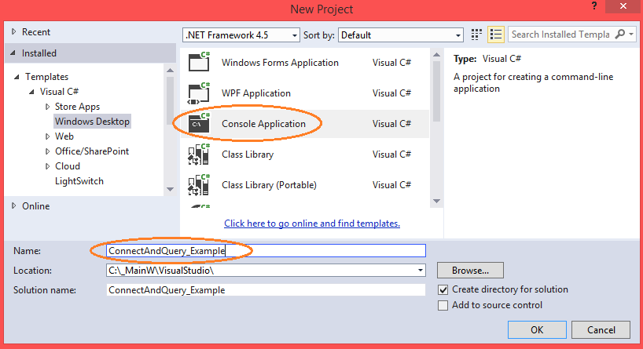
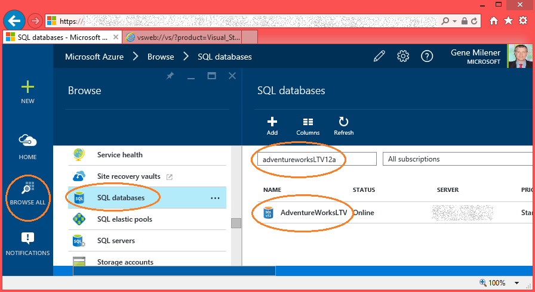
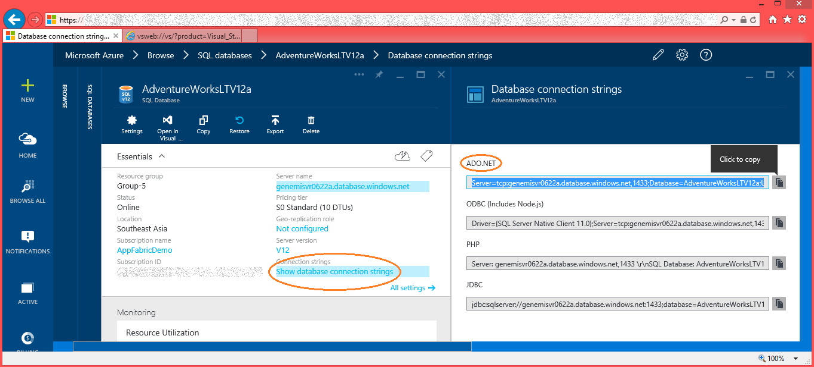
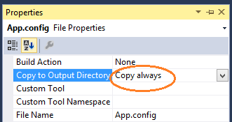
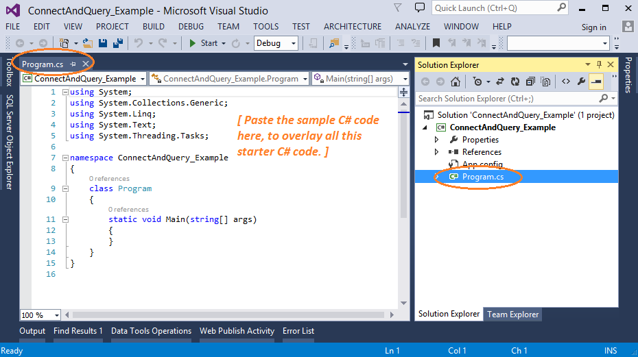

# Access an SQL database by using C#
  
Learn how to write a program in C# to query and connect to an SQL database.  
  
This article describes every step for people who are new to SQL, C#, and the ADO.NET classes.  
  
## Prerequisites  
  
1. An SQL database, such as on Microsoft SQL Server or Azure SQL Database.  
  - If you have no SQL database, you can obtain one for free on a trial basis from the Microsoft Azure cloud service named SQL Database:  
    - Sign-up for a subscription under a free trial, at [Azure free trial](https://azure.microsoft.com/pricing/free-trial/).  
2. Visual Studio Community, or a similar integrated development environment (IDE) for writing and compiling C# source code into a Microsoft .NET assembly DLL file.  
  - Microsoft now provides Visual Studio Community for *free*.  
    - [Visual Studio Community, download](http://www.visualstudio.com/products/visual-studio-community-vs)  
    - [More options for free Visual Studio](http://www.visualstudio.com/products/free-developer-offers-vs.aspx)  
  - For professional versions, Visual Studio 2013 update 4 (or later) will work.  
  
  
## 1. Create a new project in Visual Studio  
  
  
In Visual Studio, create a new project that is based on the starter template for C# > Windows > **Console Application**.  
  
  
1. Click **File** > **New** > **Project**. The **New Project** dialog is displayed.  
2. Under **Installed**, expand to C# and Windows, so that the **Console Application** option appears in the middle pane.  
      
3. For the **Name** enter **ConnectAndQuery_Example**. Click **OK**.  
  
  
## 2. Add an assembly reference for config processing  
  
  
Our C# sample uses the .NET Framework assembly **System.Configuration.dll**, so add a reference to it.  
  
  
1. In the **Solution Explorer** pane, right-click **References** > **Add Reference**. The **Reference Manager** window is displayed.  
2. Expand **Assemblies** > **Framework**.  
3. Scroll then click to highlight **System.Configuration**. Ensure that its check box if selected.  
4. Click **OK**.  
5. Compile your program by menu **BUILD** > **Build Solution**.  
  
  
## 3. Get the connection string  
  
Your C# program needs the correct connection string information for the target database. Use the [Azure Portal](https://portal.azure.com/) to copy the connection string needed to connect to the SQL database.  
  
  
1. Click **BROWSE** > **SQL databases**.  
2. Enter the name of your database into the filter text box near the upper-left of the **SQL databases** blade.  
3. Click the row for your database.  
4. After the blade appears for your database, for visual convenience you can click the standard minimize controls to collapse the blades  you used for browsing and database filtering.   
      
5. On the blade for your database, click **Show database connection strings**.  
6. If you intend to use the ADO.NET connection library, copy the string labeled **ADO**.   
      
7. In one format or another, paste the connection string information into your client program code.  
  
  
For more information, see:  
  
- [Connection Strings and Configuration Files](http://msdn.microsoft.com/library/ms254494.aspx).  
  
  
## 4. Add the connection string to the App.config file  
  
  
1. In Visual Studio, open the App.config file from the Solution Explorer pane.  
2. Add a **&#x3c;configuration&#x3e; &#x3c;/configuration&#x3e;** element as shown in the following example App.config code sample.  
  - In the value for **connectionString=**, replace the *{your_placeholders}* with your actual values:  
  
  
  
```  
    <?xml version="1.0" encoding="utf-8" ?>  
    <configuration>  
        <startup>  
            <supportedRuntime version="v4.0" sku=".NETFramework,Version=v4.5" />  
        </startup>  
      
        <connectionStrings>  
            <clear />  
            <add name="ConnectionString4NoUserIDNoPassword"  
            connectionString="Server=tcp:{your_serverName_here}.database.windows.net,1433; Database={your_databaseName_here}; Connection Timeout=30; Encrypt=True; TrustServerCertificate=False;"  
            />  
        </connectionStrings>  
    </configuration>  
```  
  
  
  
3. Save the App.config change.  
4. In the Solution Explorer pane, right-click the **App.config** node, and then click **Properties**.  
5. Set the **Copy to Output Directory** to **Copy always**.  
  - This causes the contents of your App.config file to replace the contents of the &#x2a;.exe.config file, in the directory where the &#x2a;.exe file is built to. The replacement occurs every time you recompile the &#x2a;.exe.  
  - The &#x2a;.exe.config file is read when our sample C# program runs.  
  
      
  
  
## 5. Paste in the sample C# code  
  
  
1. In Visual Studio, use the **Solution Explorer** pane to open your **Program.cs** file.  
      
2. Overwrite all the starter code in Program.cs by pasting in the following sample C# code.  
  - If you want a shorter code sample, you can assign the whole connection string as a literal to the variable **SQLConnectionString**. Then you can erase the two methods **GetConnectionStringFromExeConfig** and **GatherPasswordFromConsole**.  
  
  
  
```  
    using System;  // C#  
    using G = System.Configuration;  // System.Configuration.dll  
    using D = System.Data;           // System.Data.dll  
    using C = System.Data.SqlClient; // System.Data.dll  
    using T = System.Text;  
      
    namespace ConnectAndQuery_Example  
    {  
        public class Program  
        {  
            static public void Main()  
            {  
                string connectionString4NoUserIDNoPassword,  
                    password, userName, sqlConnectionString;  
      
                // Get most of the connection string from the App.config  
                // and ConnectAndQuery_Example.exe.config file,  
                // file, in the same directory where  
                // ConnectAndQuery_Example.exe  
                // resides.  
                connectionString4NoUserIDNoPassword =  
                    Program.GetConnectionStringFromExeConfig  
                    ("ConnectionString4NoUserIDNoPassword");  
      
                // Get the user name from keyboard input.  
                Console.WriteLine("Enter your User ID, without the trailing @ and server name: ");  
                userName = Console.ReadLine();  
      
                // Get the password from keyboard input.  
                password = Program.GatherPasswordFromConsole();  
      
                sqlConnectionString = "Password=" + password + ';' +  
                    "User ID=" + userName + ";" +  
                    connectionString4NoUserIDNoPassword;  
      
                // Create an SqlConnection from the provided connection string.  
                using (var connection =  
                        new C.SqlConnection(sqlConnectionString))  
                {  
                    // Formulate the command.  
                    var command = new C.SqlCommand();  
                    command.Connection = connection;  
      
                    // Specify the query to be executed.  
                    command.CommandType = D.CommandType.Text;  
                    command.CommandText = @"  
    SELECT TOP 3  
            ob.name,  
            CAST(ob.object_id as nvarchar(32)) as [object_id]  
        FROM sys.objects as ob  
        WHERE ob.type='IT'  
        ORDER BY ob.name;";  
      
                    // Open a connection to database.  
                    connection.Open();  
      
                    // Read data returned for the query.  
                    C.SqlDataReader reader = command.ExecuteReader();  
      
                    while (dataReader.Read())  
                    {  
                        Console.WriteLine("{0}\t{1}",  
                            reader.GetString(0),  
                            reader.GetString(1));  
                    }  
                }  
                Console.WriteLine("View the results here, then press any key to finish...");  
                Console.ReadKey(true);  
            }  
            //----------------------------------------------------------------------------------  
      
            static private string GetConnectionStringFromExeConfig  
                    (string connectionStringNameInConfig)  
            {  
                G.ConnectionStringSettings connectionStringSettings =  
                    G.ConfigurationManager  
                    .ConnectionStrings[connectionStringNameInConfig];  
      
                if (connectionStringSettings == null)  
                {  
                    throw new ApplicationException(String.Format  
                        ("Error. Connection string not found for name '{0}'.",  
                        connectionStringNameInConfig));  
                }  
                return connectionStringSettings.ConnectionString;  
            }  
      
            static public string GatherPasswordFromConsole()  
            {  
                var passwordBuilder = new T.StringBuilder(32);  
                ConsoleKeyInfo key;  
                Console.WriteLine("Enter your password: ");  
      
                do  
                {  
                    key = Console.ReadKey(true);  
                    if (key.Key != ConsoleKey.Backspace)  
                    {  
                        passwordBuilder.Append(key.KeyChar);  
                        Console.Write("*");  
                    }  
                    else  // Backspace char was entered.  
                    {  
                        // Retreat the cursor, overlay '*' with ' ', retreat again.  
                        Console.Write("\b \b");  
                        passwordBuilder.Length = passwordBuilder.Length - 1;  
                    }  
                }  
                while (key.Key != ConsoleKey.Enter); // Enter key will end the looping.  
      
                Console.WriteLine(Environment.NewLine);  
                return passwordBuilder.ToString();  
            }  
        }  
    }  
```  
  
  
  
### 5.1 Compile your program  
  
  
1. In Visual Studio, compile your program by clicking the menu **Build** > **Build Solution**.  
  
  
### 5.2 Summary of actions in the sample program  
  
  
1. Reads most of the SQL connection string from a config file.  
2. Gathers user name and password from the keyboard, and adds them to complete the connection string.  
3. Uses the connection string, and ADO.NET classes, to connect to your database on SQL Database.  
4. Issues an SQL **SELECT** to read from the **sys.objects** view that exists in every database.  
5. Prints the returned rows to the console.  
  
  
We try to keep the C# sample short. Yet we added code to read a config file to honor several requests from customers like you. We agree that production quality programs should use config files instead of literals hardcoded in the .exe.  
  
  
> [AZURE.WARNING] In the interest of code brevity, we opted not to include code for exception handling and retry logic in this educational sample. However your production programs that interact with a cloud database should include both.  
>  
> [Here](Code%20sample:%20Retry%20logic%20in%20C%23%20for%20connecting%20to%20Azure%20SQL%20Database.md) is a link to a code sample that has retry logic.  
  
  
## 6. Add allowed IP address range in the server firewall  
  
  
Your client C# program cannot connect to SQL Database until the IP address of the client computer has been added in the SQL Database firewall. Your program will fail with a handy error message that states the necessary IP address.  
  
  
You can use the [Azure Portal](https://portal.azure.com/) to add the IP address.  
  
  
1. Log in to the [Azure portal](https://portal.azure.com/) at http://portal.azure.com/.  
2. In the left banner, click **BROWSE ALL**. The **Browse** blade is displayed.  
3. Scroll and click **SQL servers**. The **SQL servers** blade is displayed.  
    ???Find your Azure SQL Database server in the portal](firewall-ip-b21-v12portal-findsvr.png)  
4. For convenience, click the minimize control on the earlier **Browse** blade.  
5. In the filter text box, start typing the name of your server. Your row is displayed.  
6. Click the row for your server. A blade for your server is displayed.  
7. On your server blade, click **Settings**. The **Settings** blade is displayed.  
8. Click **Firewall**. The **Firewall Settings** blade is displayed.  
    ???Click Settings > Firewall](firewall-ip-b31-v12portal-settingsfirewall.png)  
9. Click **Add Client IP**. Type in a name for your new rule into the first text box.  
10. Type in the low and high IP address values for the range you want to enable.  
    - It can be handy to have the low value end with **.0** and the high with **.255**.  
    ???Add an IP address range to allow](firewall-ip-b41-v12portal-addrange.png)  
11. Click **Save**.  
  
  
For more information, see:  
  
- [How to: Configure firewall settings on SQL Database](http://azure.microsoft.com/documentation/articles/sql-database-configure-firewall-settings/).  
  
  
  
## 7. Run the program  
  
  
1. In Visual Studio, run your C# query program by menu **DEBUG** > **Start Debugging**. A console window is displayed.  
  - Or, you can open a console window to the folder where your .exe is built, and run ConnectAndQuery_Example.exe.  
2. You enter your user name and password, as directed.  
  - A few connection tools require your user name to have "@{your_serverName_here}" appended, but for ADO.NET this suffix is optional. Don't bother typing the suffix.  
3. Rows of retrieved data are displayed.  
  
  
## 8. Related links  
  
  
- If your client program runs on an Azure VM, learn about TCP ports other than 1433 at:  
  - [Ports beyond 1433 for ADO.NET 4.5 and SQL Database V12](http://azure.microsoft.com/documentation/articles/sql-database-develop-direct-route-ports-adonet-v12/).  
