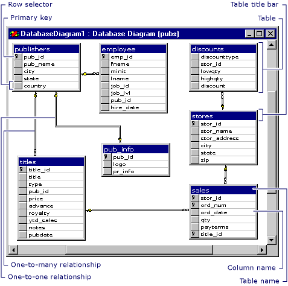

# Design Database Diagrams (Visual Database Tools)
The Database Designer is a visual tool that allows you to design and visualize a database to which you are connected. When designing a database, you can use Database Designer to create, edit, or delete tables, columns, keys, indexes, relationships, and constraints. To visualize a database, you can create one or more diagrams illustrating some or all of the tables, columns, keys, and relationships in it.  
  
  
  
For any database, you can create as many database diagrams as you like; each database table can appear on any number of diagrams. Thus, you can create different diagrams to visualize different portions of the database, or to accentuate different aspects of the design. For example, you can create a large diagram showing all tables and columns, and you can create a smaller diagram showing all tables without showing the columns.  
  
Each database diagram you create is stored in the associated database.  
  
## Tables and Columns in a Database Diagram  
Within a database diagram, each table can appear with three distinct features: a title bar, a row selector, and a set of property columns.  
  
**Title Bar** The title bar shows the name of the table  
  
If you have modified a table and have not yet saved it, an asterisk (*) appears at the end of the table name to indicate unsaved changes. For information about saving modified tables and diagrams, see [Work with Database Diagrams &#40;Visual Database Tools&#41;](../content/Work-with-Database-Diagrams--Visual-Database-Tools-.md)  
  
**Row Selector** You can click the row selector to select a database column in the table. The row selector displays a key symbol if the column is in the table's primary key. For information about primary keys, see [Working with Keys (Visual Database Tools)](assetId:///31fbcc9f-2dc5-4bf9-aa50-ed70ec7b5bcd).  
  
**Property Columns** The set of property columns is visible only in the certain views of your table. You can view a table in any of five different views to help you manage the size and layout of your diagram.  
  
For more information about table views, see [Customize the Amount of Information Displayed in Diagrams &#40;Visual Database Tools&#41;](../content/Customize-the-Amount-of-Information-Displayed-in-Diagrams--Visual-Database-Tools-.md).  
  
## Relationships in a Database Diagram  
Within a database diagram, each relationship can appear with three distinct features: endpoints, a line style, and related tables.  
  
**Endpoints** The endpoints of the line indicate whether the relationship is one-to-one or one-to-many. If a relationship has a key at one endpoint and a figure-eight at the other, it is a one-to-many relationship. If a relationship has a key at each endpoint, it is a one-to-one relationship.  
  
**Line Style** The line itself (not its endpoints) indicates whether the Database Management System (DBMS) enforces referential integrity for the relationship when new data is added to the foreign-key table. If the line appears solid, the DBMS enforces referential integrity for the relationship when rows are added or modified in the foreign-key table. If the line appears dotted, the DBMS does not enforce referential integrity for the relationship when rows are added or modified in the foreign-key table.  
  
**Related Tables** The relationship line indicates that a foreign-key relationship exists between one table and another. For a one-to-many relationship, the foreign-key table is the table near the line's figure-eight symbol. If both endpoints of the line attach to the same table, the relationship is a reflexive relationship. For more information, see [Draw Reflexive Relationships &#40;Visual Database Tools&#41;](../content/Draw-Reflexive-Relationships--Visual-Database-Tools-.md).  
  
## In this Section  
[Understand Database Diagram Ownership &#40;Visual Database Tools&#41;](../content/Understand-Database-Diagram-Ownership--Visual-Database-Tools-.md)  
  
[Navigate in Database Diagram Designer &#40;Visual Database Tools&#41;](../content/Navigate-in-Database-Diagram-Designer--Visual-Database-Tools-.md)  
  
[Set Up Database Diagram Designer &#40;Visual Database Tools&#41;](../content/Set-Up-Database-Diagram-Designer--Visual-Database-Tools-.md)  
  
[Upgrade Database Diagrams from Previous Editions &#40;Visual Database Tools&#41;](../content/Upgrade-Database-Diagrams-from-Previous-Editions--Visual-Database-Tools-.md)  
  
[Open Database Diagram Designer &#40;Visual Database Tools&#41;](../content/Open-Database-Diagram-Designer--Visual-Database-Tools-.md)  
  
## See Also  
[Work with Database Diagrams &#40;Visual Database Tools&#41;](../content/Work-with-Database-Diagrams--Visual-Database-Tools-.md)  
[Work with Tables in Database Diagram &#40;Visual Database Tools&#41;](../content/Work-with-Tables-in-Database-Diagram--Visual-Database-Tools-.md)  
[Work with Diagram Layout &#40;Visual Database Tools&#41;](../content/Work-with-Diagram-Layout--Visual-Database-Tools-.md)  
  
