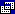
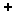
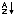
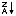
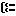
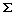

# Diagram Pane (Visual Database Tools)
The Diagram pane presents a graphic display of the tables or table-valued objects you have selected from the data connection. It also shows any join relationships among them.  
  
In the Diagram pane you can:  
  
-   Add or remove tables and table-valued objects and specify data columns for output.  
  
-   Create or modify joins between tables and table-valued objects.  
  
When you make a change in the Diagram pane, the Criteria pane and SQL pane are updated to reflect your change. For example, if you select a column for output in a table or table-valued object window in the Diagram pane, the Query and View Designer adds the data column to the Criteria pane and to the SQL statement in the SQL pane.  
  
Each table or table-valued object appears as a separate window in the Diagram pane. The icon in the title bar of each rectangle indicates what type of object the rectangle represents, as illustrated in the following table.  
  
## Options  
**Tables**  
Lists the tables you can add to the Diagram pane. To add a table, select it and click **Add**. To add several tables at once, select them and click **Add**.  
  
**Views**  
Lists the views you can add to the Diagram pane. To add a view, select it and click **Add**. To add several views at once, select them and click **Add**.  
  
**Functions**  
Lists the user-defined functions you can add to the Diagram pane. To add a function, select it and click **Add**. To add several functions at once, select them and click **Add**.  
  
**Local Tables**  
Lists tables created by queries rather than the ones that belong to the database.  
  
**Synonyms**  
Lists the synonyms you can add to the Diagram pane. To add a synonym, select it and click **Add**. To add several synonyms at once, select them and click **Add**.  
  
|Icon|Object type|  
|--------|---------------|  
||Table|  
||Query or View|  
||Linked Table|  
||User-Defined Function|  
||Linked View|  
  
Each rectangle shows the data columns for the table or table-valued object. Check boxes and symbols appear next to the names of columns to indicate how the columns are used in the query. ToolTips display information such as data type and size for columns.  
  
The following table lists the check boxes and symbols used in the rectangle for each table or table-valued object.  
  
|Check box or symbol|Description|  
|-----------------------|---------------|  
|      |Specifies whether a data column appears in the query result set (Select query) or is used in an Update, Insert From, Make Table, or Insert Into query. Select the column to add it to the results. If **(All Columns)** is selected, all data columns appear in the output.  The icon used with the check box changes according to the type of query you are creating. When creating a Delete query, you cannot select individual columns.|  
|  |Indicates that the data column is being used to order the query results (is part of an ORDER BY clause). The icon appears as A-Z if the sort order is ascending or Z-A if sort order is descending.|  
||Indicates that the data column is being used to create a grouped result set (is part of a GROUP BY clause) in an aggregate query.|  
||Indicates that the data column is included in a search condition for the query (is part of a WHERE or HAVING clause).|  
||Indicates that the contents of the data column are being summarized for output (are included in a SUM, AVG, or other aggregate function).|  
  
> [!NOTE]  
> Query and View Designer will not display data columns for a table or table-valued object if you do not have sufficient access rights to it or if the database driver cannot return information about it. In such cases, the Query and View Designer displays only a title bar for the table or table-structured object.  
  
## Joined Tables on the Diagram Pane  
If the query involves a join, a join line appears between the data columns involved in the join. If the joined data columns are not displayed (for example, the table or table-valued object window is minimized or the join involves an expression), the Query and View Designer places the join line in the title bar of the rectangle representing the table or table-valued object. The Query and View Designer displays one join line for each join condition.  
  
The shape of the icon in the middle of the join line indicates how the tables or table-structured objects are joined. If the join clause uses an operator other than equal (=), the operator is displayed in the join line icon. The following table lists the icons that can be displayed in a join line.  
  
|Join line icon|Description|  
|------------------|---------------|  
||Inner join (created using equal sign).|  
||Inner join based on the "greater than" operator. (The operator displayed in the join line icon reflects the operator used in the join.)|  
||Outer join in which all rows from the table represented on the left will be included, even if they do not have matches in the related table.|  
||Outer join in which all rows from the table represented on the right will be included, even if they do not have matches in the related table.|  
||A full outer join in which all rows from both tables will be included, even if they do not have matches in the related table.|  
  
Icons on the ends of the join line indicate the type of join. The following table lists the types of joins and the icons that can be displayed on the ends of the join line.  
  
|Icon on ends of join line|Description|  
|-----------------------------|---------------|  
||One-to-one join|  
||One-to-many join|  
||Query and View Designer cannot determine join type|  
  
## See Also  
[Design Queries and Views How-to Topics &#40;Visual Database Tools&#41;](../content/Design-Queries-and-Views-How-to-Topics--Visual-Database-Tools-.md)  
[Criteria Pane &#40;Visual Database Tools&#41;](../content/Criteria-Pane--Visual-Database-Tools-.md)  
[Sort and Group Query Results &#40;Visual Database Tools&#41;](../content/Sort-and-Group-Query-Results--Visual-Database-Tools-.md)  
  
