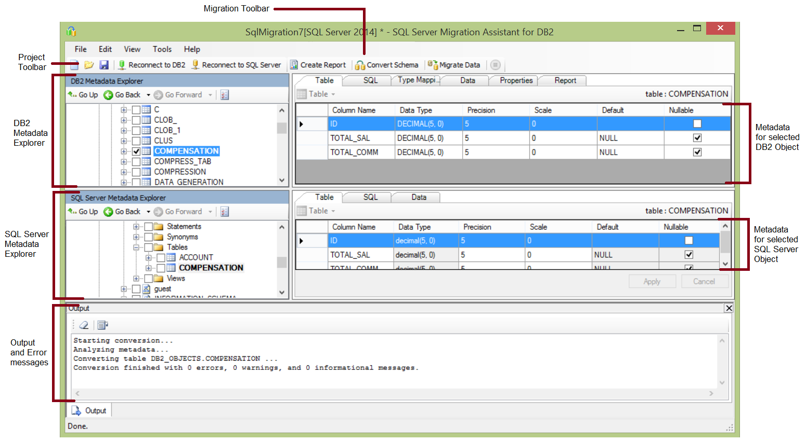

# Getting Started with SSMA for DB2 (DB2ToSQL)
[!INCLUDE[ssNoVersion](../content/includes/ssNoVersion_md.md)] Migration Assistant (SSMA) for DB2 lets you quickly convert DB2 database schemas to [!INCLUDE[ssNoVersion](../content/includes/ssNoVersion_md.md)] schemas, upload the resulting schemas into [!INCLUDE[ssNoVersion](../content/includes/ssNoVersion_md.md)] and migrate data from DB2 to [!INCLUDE[ssNoVersion](../content/includes/ssNoVersion_md.md)].  
  
This topic introduces the installation process, and then helps familiarize you with the SSMA user interface.  
  
## Installing SSMA  
To use SSMA, you first must install the SSMA client program on a computer that can access both the source DB2 database and the target instance of [!INCLUDE[ssNoVersion](../content/includes/ssNoVersion_md.md)]. DB2 OLEDB providers on the computer that is running [!INCLUDE[ssNoVersion](../content/includes/ssNoVersion_md.md)]. These components support data migration and the emulation of DB2 system functions. For installation instructions, see [Installing SSMA for DB2 &#40;DB2ToSQL&#41;](../content/Installing-SSMA-for-DB2--DB2ToSQL-.md).  
  
To start SSMA, click **Start**, point to **All Programs**, point to **[!INCLUDE[ssNoVersion](../content/includes/ssNoVersion_md.md)] Migration Assistant for DB2**, and then click **[!INCLUDE[ssNoVersion](../content/includes/ssNoVersion_md.md)] Migration Assistant for DB2**.  
  
## SSMA for DB2 User Interface  
After SSMA is installed, you can use SSMA to migrate DB2 databases to [!INCLUDE[ssNoVersion](../content/includes/ssNoVersion_md.md)]. It helps to become familiar with the SSMA user interface before you start. The following diagram shows the user interface for SSMA, including the metadata explorers, metadata, toolbars, output pane, and error list pane:  
  
  
  
To start a migration, you must first create a new project. Then, you connect to an DB2 database. After a successful connection, DB2 schemas will appear in DB2 Metadata Explorer. You can then right-click objects in DB2 Metadata Explorer to perform tasks such as create reports that assess conversions to [!INCLUDE[ssNoVersion](../content/includes/ssNoVersion_md.md)]. You can also perform these tasks by using the toolbars and menus.  
  
You must also connect to an instance of [!INCLUDE[ssNoVersion](../content/includes/ssNoVersion_md.md)]. After a successful connection, a hierarchy of [!INCLUDE[ssNoVersion](../content/includes/ssNoVersion_md.md)] databases will appear in [!INCLUDE[ssNoVersion](../content/includes/ssNoVersion_md.md)] Metadata Explorer. After you convert DB2 schemas to [!INCLUDE[ssNoVersion](../content/includes/ssNoVersion_md.md)] schemas, select those converted schemas in [!INCLUDE[ssNoVersion](../content/includes/ssNoVersion_md.md)] Metadata Explorer, and then synchronize the schemas with [!INCLUDE[ssNoVersion](../content/includes/ssNoVersion_md.md)].  
  
After you synchronize converted schemas with [!INCLUDE[ssNoVersion](../content/includes/ssNoVersion_md.md)], you can return to DB2 Metadata Explorer and migrate data from DB2 schemas into [!INCLUDE[ssNoVersion](../content/includes/ssNoVersion_md.md)] databases.  
  
For more information about these tasks and how to perform them, see [Migrating DB2 Databases to SQL Server &#40;DB2ToSQL&#41;](../content/Migrating-DB2-Databases-to-SQL-Server--DB2ToSQL-.md).  
  
The following sections describe the features of the SSMA user interface.  
  
### Metadata Explorers  
SSMA contains two metadata explorers to browse and perform actions on DB2 and [!INCLUDE[ssNoVersion](../content/includes/ssNoVersion_md.md)] databases.  
  
#### DB2 Metadata Explorer  
DB2 Metadata Explorer shows information about DB2 schemas. By using DB2 Metadata Explorer, you can perform the following tasks:  
  
-   Browse the objects in each schema.  
  
-   Select objects for conversion, and then convert the objects to [!INCLUDE[ssNoVersion](../content/includes/ssNoVersion_md.md)] syntax. For more information, see [Converting DB2 Schemas &#40;DB2ToSQL&#41;](../content/Converting-DB2-Schemas--DB2ToSQL-.md).  
  
-   Select tables for data migration, and then migrate the data from those tables to [!INCLUDE[ssNoVersion](../content/includes/ssNoVersion_md.md)]. For more information, see [Migrating DB2 Databases to SQL Server &#40;DB2ToSQL&#41;](../content/Migrating-DB2-Databases-to-SQL-Server--DB2ToSQL-.md).  
  
#### SQL Server Metadata Explorer  
[!INCLUDE[ssNoVersion](../content/includes/ssNoVersion_md.md)] Metadata Explorer shows information about an instance of [!INCLUDE[ssNoVersion](../content/includes/ssNoVersion_md.md)]. When you connect to an instance of [!INCLUDE[ssNoVersion](../content/includes/ssNoVersion_md.md)], SSMA retrieves metadata about that instance and stores it in the project file.  
  
You can use [!INCLUDE[ssNoVersion](../content/includes/ssNoVersion_md.md)] Metadata Explorer to select converted DB2 database objects, and then synchronize those objects with the instance of [!INCLUDE[ssNoVersion](../content/includes/ssNoVersion_md.md)].  
  
### Metadata  
To the right of each metadata explorer are tabs that describe the selected object. For example, if you select a table in DB2 Metadata Explorer, six tabs will appear: **Table**, **SQL**, **Type Mapping,Report**, **Properties**, and **Data**. The **Report** tab contains information only after you create a report that contains the selected object. If you select a table in [!INCLUDE[ssNoVersion](../content/includes/ssNoVersion_md.md)] Metadata Explorer, three tabs will appear: **Table**, **SQL**, and **Data**.  
  
Most metadata settings are read-only. However, you can alter the following metadata:  
  
-   In DB2 Metadata Explorer, you can alter procedures and type mappings. To convert the altered procedures and type mappings, make changes before you convert schemas.  
  
-   In [!INCLUDE[ssNoVersion](../content/includes/ssNoVersion_md.md)] Metadata Explorer, you can alter the [!INCLUDE[tsql](../content/includes/tsql_md.md)] for stored procedures. To see these changes in [!INCLUDE[ssNoVersion](../content/includes/ssNoVersion_md.md)], make these changes before you load the schemas into [!INCLUDE[ssNoVersion](../content/includes/ssNoVersion_md.md)].  
  
Changes made in a metadata explorer are reflected in the project metadata, not in the source or target databases.  
  
### Toolbars  
SSMA has two toolbars: a project toolbar and a migration toolbar.  
  
#### The Project Toolbar  
The project toolbar contains buttons for working with projects, connecting to DB2, and connecting to [!INCLUDE[ssNoVersion](../content/includes/ssNoVersion_md.md)]. These buttons resemble the commands on the **File** menu.  
  
#### Migration Toolbar  
The following table shows the migration toolbar commands:  
  
|||  
|-|-|  
|Button|Function|  
|**Create Report**|Converts the selected DB2 objects to [!INCLUDE[ssNoVersion](../content/includes/ssNoVersion_md.md)] syntax, and then creates a report that shows how successful the conversion was.  This command is disabled unless objects are selected in DB2 Metadata Explorer.|  
|**Convert Schema**|Converts the selected DB2 objects to [!INCLUDE[ssNoVersion](../content/includes/ssNoVersion_md.md)] objects.  This command is disabled unless objects are selected in DB2 Metadata Explorer.|  
|||  
|**Migrate Data**|Migrates data from the DB2 database to [!INCLUDE[ssNoVersion](../content/includes/ssNoVersion_md.md)]. Before you run this command, you must convert the DB2 schemas to [!INCLUDE[ssNoVersion](../content/includes/ssNoVersion_md.md)] schemas, and then load the objects into [!INCLUDE[ssNoVersion](../content/includes/ssNoVersion_md.md)].  This command is disabled unless objects are selected in DB2 Metadata Explorer.|  
|**Stop**|Stops the current process.|  
  
### Menus  
The following table shows the SSMA menus.  
  
|||  
|-|-|  
|Menu|Description|  
|**File**|Contains commands for working with projects, connecting to DB2, and connecting to [!INCLUDE[ssNoVersion](../content/includes/ssNoVersion_md.md)].|  
|**Edit**|Contains commands for finding and working with text in the details pages, such as copying [!INCLUDE[tsql](../content/includes/tsql_md.md)] from the SQL details pane. Also contains the **Manage Bookmarks** option, where you will be able to see a list of existing bookmarks. You can use the buttons on the right side of the dialog to manage the bookmarks.|  
|**View**|Contains the **Synchronize Metadata Explorers** command. That synchronizes the objects between DB2 Metadata Explorer and [!INCLUDE[ssNoVersion](../content/includes/ssNoVersion_md.md)] Metadata Explorer. Also contains commands to show and hide the **Output** and **Error List** panes and an option **Layouts** to manage the Layouts.|  
|**Tools**|Contains commands to create reports, and migrate objects and data. Also provides access to the **Global Settings** and **Project Settings** dialog boxes.|  
|**Help**|Provides access to SSMA Help and to the **About** dialog box.|  
  
### Output Pane and Error List Pane  
The **View** menu provides commands to toggle the visibility of the Output pane and the Error List pane:  
  
-   The output pane shows status messages from SSMA during object conversion, object synchronization, and data migration.  
  
-   The Error List pane shows error, warning, and informational messages in a sortable list.  
  
## See Also  
[Migrating DB2 Data into SQL Server &#40;DB2ToSQL&#41;](../content/Migrating-DB2-Data-into-SQL-Server--DB2ToSQL-.md)  
[User Interface Reference &#40;DB2ToSQL&#41;](../content/User-Interface-Reference--DB2ToSQL-.md)  
  
