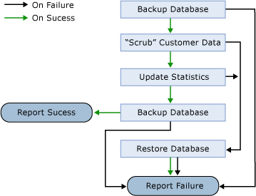

# Handle Multiple Job Steps
If your job has more than one job step, you must specify the order in which the job steps run. This is called *control of flow**.* You can add new job steps and rearrange the flow of job steps at any time; the changes take effect the next time the job is run. This illustration shows the control of flow for a database backup job.  
  
  
  
The first step is Backup Database. If this step fails, [!INCLUDE[ssNoVersion](../content/includes/ssNoVersion_md.md)] Agent reports failure to the operator who is defined to receive notification. If the Backup Database step succeeds, the job proceeds to the next step, "Scrub" Customer Data. If this step fails, [!INCLUDE[ssNoVersion](../content/includes/ssNoVersion_md.md)] Agent skips forward to Restore Database. If "Scrub" Customer Data succeeds, the job proceeds to the next step, Update Statistics, and so on, until the final step either results in Report Success or Report Failure.  
  
You define a control-of-flow action for the success and failure of each job step. You must specify an action to be taken when a job step succeeds and an action to be taken when a job step fails. You can also define the number of retry attempts for failed job steps and the interval between the retry attempts.  
  
> [!NOTE]  
> When you use the [!INCLUDE[ssNoVersion](../content/includes/ssNoVersion_md.md)] Agent graphical user interface (GUI) and delete one or more steps from a multistep job, the GUI removes all job steps and then adds the remaining steps back with the correct on-success or on-failure references. For example, suppose you have a job with five steps, and the first step is configured to jump to step 4 if it completes successfully. If you delete step 3, the GUI removes all steps for this job and adds the remaining four steps (1, 2, 4, and 5) with corrected references. In this case, the reference in step 1 would be reconfigured to jump to step 3 if step 1 completes successfully.  
  
Job steps must be self-contained. That is, a job cannot pass Boolean values, data, or numeric values between job steps. You can, however, pass values from one [!INCLUDE[tsql](../content/includes/tsql_md.md)] job step to another by using permanent tables or global temporary tables. You can pass values from job steps that run executable programs from one job step to another job step by using files. For example, the executable run by one job step writes a file, and the executable run by a subsequent job step reads the file.  
  
> [!NOTE]  
> If you create looping job steps (job step 1 is followed by job step 2, then job step 2 returns to job step 1), a warning message appears when the job is created using [!INCLUDE[ssManStudioFull](../content/includes/ssManStudioFull_md.md)].  
  
[!INCLUDE[ssNoVersion](../content/includes/ssNoVersion_md.md)] Agent records job and job step information in the job history.  
  
## See Also  
[sp_add_job](assetId:///6ca8fe2c-7b1c-4b59-b4c7-e3b7485df274)  
[sysjobhistory](assetId:///1b1fcdbb-2af2-45e6-bf3f-e8279432ce13)  
[sysjobs (Transact-SQL)](assetId:///e244a6a5-54c2-47a6-8039-dd1852b0ae59)  
[sysjobsteps](assetId:///978b8205-535b-461c-91f3-af9b08eca467)  
[Implement Jobs](../content/Implement-Jobs.md)  
[Manage Job Steps](../content/Manage-Job-Steps.md)  
  
