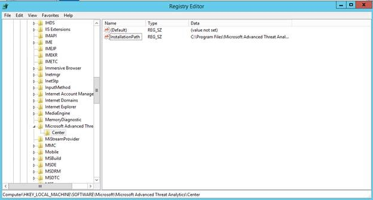
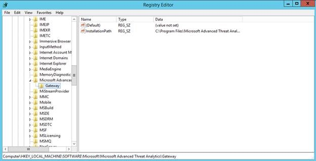

# ATA Release Notes
These release notes provide information about known issues in this version of  Advanced Threat Analytics.

## What's new in this version?

-   Support for Windows Event Forwarding (WEF) to send events directly from the domain controllers to the ATA gateway.

-   Pass-The-Hash detection enhancements on corporate resources by combining DPI (Deep Packet Inspection) and Windows event logs.

-   Enhancements for the support of non-domain joined devices and non-Windows devices for detection and visibility.

-   Performance improvements to support more traffic per ATA Gateway.

-   Performance improvements to support more ATA Gateways per ATA Center.

-   A new automatic name resolution process was added which matches computer names and IP addresses – this unique capability will save precious time in the investigation process and provide strong evidence for security analysts

-   Improved ability to collect input from users to automatically fine-tune the detection process.

-   Automatic detection for NAT devices.

-   Automatic failover when domain controllers are not reachable.

-   System health monitoring and notifications now provide the overall health state of the deployment as well as specific issues related to configuration and connectivity.

-   Visibility into sites and locations where entities operate.

-   Multi-domain support.

-   Support for Single Label Domains (SLD).

-   Support for modifying the IP address and certificate of the ATA Gateways and ATA Center.

-   Telemetry to help improve customer experience.

## Known issues
The following known issues exist in this version.

### Network Capture Software
On the ATA Gateway, the only supported network capture software you can install is [Microsoft Network Monitor 3.4](http://www.microsoft.com/en-us/download/details.aspx?id=4865). Do not install Microsoft Message Analyzer or any other network capturing software. Installing other software will cause the ATA Gateway to stop functioning properly.

### Installation from Zip file
When installing the ATA Gateway, make sure to extract the files from the zip file to a local directory and install it from there. Do not install the ATA Gateway directly from within the zip file or the installation will fail.

### Uninstalling previous versions of ATA
If you installed a previous version of ATA, Public Preview or Private Preview versions, you must uninstall the ATA Center and ATA Gateways before installing this release of ATA.

You must also delete the Database files and log files. The databases from previous versions of ATA are not compatible with the GA version of ATA.

When you attempt to uninstall the ATA Center or ATA Gateway, if the ATA installation opens instead of the uninstallation, you will need to add the following registry key and then uninstall ATA again.

**ATA Center**

-   HKLM\SOFTWARE\Microsoft\Microsoft Advanced Threat Analytics\Center

-   Add a new String value named `InstallationPath` with a value of `C:\Program Files\Microsoft Advanced Threat Analytics\Center` . This is the default installation folder. If you changed the installation folder enter the path where ATA is installed.

    

**ATA Gateway**

-   HKLM\SOFTWARE\Microsoft\Microsoft Advanced Threat Analytics\Gateway

-   Add a new String value named `InstallationPath` with a value of `C:\Program Files\Microsoft Advanced Threat Analytics\Gateway`. This is the default installation folder.  If you changed the installation folder enter the path where ATA is installed.

    

After uninstalling, delete the installation folder on both the ATA Center and the ATA Gateway.  If you installed the Database in a separate folder, delete the Database folder on the ATA Center.

### Health alert - disconnected ATA Gateway
If you have more than one ATA Gateway and have Disconnected ATA Gateway alerts, automatic resolve will work on only one of them, leaving the rest in an Open status. You must manually confirm that the ATA Gateway is up and the service is running and manually resolve the alert.

### KB on virtualization host
Do not install KB 3047154 on a virtualization host. This may cause port mirroring to stop working properly.

## See Also
[For support, check out our forum!](https://social.technet.microsoft.com/Forums/security/en-US/home?forum=mata)

