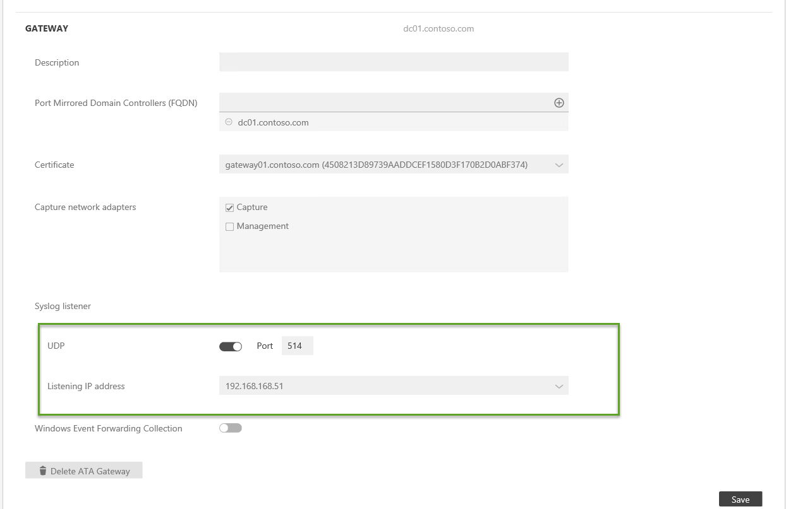

# Configure Event Collection
To enhance ATA detection of Pass-the-Hash, ATA needs Windows Event log ID 4776. This can be forwarded to the ATA Gateway in one of two ways, by configuring the ATA Gateway to listen for SIEM events or by [Configuring Windows Event Forwarding](#ATA_event_WEF).

## Configuring the ATA Gateway to listen for SIEM events

1.  On the ATA Gateway configuration, enable **Syslog Listener UDP**.

    Set the Listening IP Address as described in the picture, below. The default port is 514.

    

2.  Configure your SIEM or Syslog server to forward Windows Event ID 4776 to the IP address selected above. For additional information on configuring your SIEM, refer to your SIEM online help or technical support options for specific formatting requirements for each SIEM server.

### SIEM support
ATA supports SIEM events in the following formats:

#### RSA Security Analytics
&lt;Syslog Header&gt;RsaSA\n2015-May-19 09:07:09\n4776\nMicrosoft-Windows-Security-Auditing\nSecurity\XXXXX.subDomain.domain.org.il\nYYYYY$\nMMMMM \n0x0

-   Syslog header is optional.

-   “\n” character separator is required between all fields.

-   The fields, in order, are:

    1.  RsaSA constant (must appear).

    2.  The timestamp of the actual event (make sure it’s not the timestamp of the arrival to the SIEM or when it’s sent to ATA). Preferably  in milliseconds accuracy, this is very important.

    3.  The windows event ID

    4.  The windows event provider name

    5.  The windows event log name

    6.  The name of the computer receiving the event (the DC in this case)

    7.  The name of the user authenticating

    8.  The name of the source host name

    9. The result code of the NTLM

-   The order is important and nothing else should be included in the message.

#### HP Arcsight
CEF:0|Microsoft|Microsoft Windows||Microsoft-Windows-Security-Auditing:4776|The domain controller attempted to validate the credentials for an account.|Low| externalId=4776 cat=Security rt=1426218619000 shost=KKKKKK dhost=YYYYYY.subDomain.domain.com duser=XXXXXX cs2=Security cs3=Microsoft-Windows-Security-Auditing cs4=0x0 cs3Label=EventSource cs4Label=Reason or Error Code

-   Must comply with the protocol definition.

-   No syslog header.

-   The header part (the part that’s separated by a pipe) must exist (as stated in the protocol).

-   The following keys in the _Extension_ part must be present in the event:

    -   externalId = the Windows event ID

    -   rt = the timestamp of the actual event (make sure it’s not the timestamp of the arrival to the SIEM or when it’s sent to us). Preferably  in milliseconds accuracy, this is very important.

    -   cat = the Windows event log name

    -   shost = the source host name

    -   dhost = the computer receiving the event (the DC in this case)

    -   duser = the user authenticating

-   The order is not important for the _Extension_ part

-   There must be a custom key and keyLable for these two fields:

    -   “EventSource”

    -   “Reason or Error Code” = The result code of the NTLM

#### Splunk
&lt;Syslog Header&gt;\r\nEventCode=4776\r\nLogfile=Security\r\nSourceName=Microsoft-Windows-Security-Auditing\r\nTimeGenerated=20150310132717.784882-000\r\ComputerName=YYYYY\r\nMessage=

The computer attempted to validate the credentials for an account.

Authentication Package:              MICROSOFT_AUTHENTICATION_PACKAGE_V1_0

Logon Account: Administrator

Source Workstation:       SIEM

Error Code:         0x0

-   Syslog header is optional.

-   There’s a “\r\n” character separator between all required fields.

-   The fields are in key=value format.

-   The following keys must exists and have a value:

    -   EventCode = the Windows event ID

    -   Logfile = the Windows event log name

    -   SourceName = The Windows event provider name

    -   TimeGenerated = the timestamp of the actual event (make sure it’s not the timestamp of the arrival to the SIEM or when it’s sent to ATA). The format should match yyyyMMddHHmmss.FFFFFF, preferably  in milliseconds accuracy, this is very important.

    -   ComputerName = the source host name

    -   Message = the original event text from the Windows event

-   The Message Key and value MUST be last.

-   The order is not important for the key=value pairs.

## Configuring Windows Event Forwarding
If you do not have a SIEM server you can configure your domain controllers to forward Windows Event ID 4776 directly to one of your ATA Gateways.

1.  On the ATA Gateway configuration, enable **Windows Event Forwarding Collection**.

    > [!NOTE]
    > When you enable this setting the ATA Gateway will look in the Forwarded Events log for Windows Events that have been forwarded to it from the domain controllers.

    -   [Configure the computers to forward and collect events](https://technet.microsoft.com/en-us/library/cc748890).

2.  Configure your domain controllers to forward Windows Event ID 4776 to the ATA Gateways. For additional information on Windows Event Forwarding, see [Configure Computers to Forward and Collect Events](https://technet.microsoft.com/en-us/library/cc748890).

## See Also
[ATA Installation](../../ems/ATA_Content/ATA-Installation.md)
 [For support, check out our forum!](https://social.technet.microsoft.com/Forums/security/en-US/home?forum=mata)

