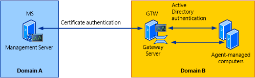

# About Gateway Servers in Operations Manager
[!INCLUDE[om12long](../../om/manage//om12long_md.md)] requires mutual authentication be performed between agents and management servers prior to the exchange of information between them.  To secure the authentication process between the two, the process is encrypted.  When the agent and the management server reside in the same Active Directory domain or in Active Directory domains that have established trust relationships, they make use of Kerberos V5 authentication mechanisms provided by Active Directory. When the agents and management servers do not lie within the same trust boundary, other mechanisms must be used to satisfy the secure mutual authentication requirement.  
  
In [!INCLUDE[om12short](../../om/manage//om12short_md.md)], this is accomplished through the use of X.509 certificates issued for each computer. If there are many agent\-monitored computers, this results in high administrative overhead for managing all those certificates.  In addition, if there is a firewall between the agents and management servers, multiple authorized endpoints must be defined and maintained in the firewall rules to allow communication between them.  
  
To reduce this administrative overhead, [!INCLUDE[om12short](../../om/manage//om12short_md.md)] has a server role called the gateway server. Gateway servers are located within the trust boundary of the agents and can participate in the mandatory mutual authentication. Because they lie within the same trust boundary as the agents, the Kerberos V5 protocol for Active Directory is used between the agents and the gateway server. Each agent then communicates only with the gateway servers that it is aware of. The gateway servers communicate with the management servers.  
  
To support the mandatory secure mutual authentication between the gateway servers and the management servers, certificates must be issued and installed, but only for the gateway and management servers. This reduces the number of certificates required, and in the case of an intervening firewall it also reduces the number of authorized endpoints to be defined in the firewall rules. The following illustration shows the authentication relationships in a management group using a gateway server.  
  
  
  
For information about installing a gateway server, see [Deploying a Gateway Server](http://go.microsoft.com/fwlink/p/?LinkId=231391) in the Deployment Guide.  
  
## See Also  
[Monitoring Across Untrusted Boundaries in Operations Manager](../../om/manage/Monitoring-Across-Untrusted-Boundaries-in-Operations-Manager.md)  
[Determining the Health of Gateway Servers](../../om/manage/Determining-the-Health-of-Gateway-Servers.md)  
[Using Multiple Gateway Servers](../../om/manage/Using-Multiple-Gateway-Servers.md)  
[How to Configure Agent Failover to Multiple Gateway Servers](../../om/manage/How-to-Configure-Agent-Failover-to-Multiple-Gateway-Servers.md)  
[How to Configure a Gateway Server to Failover Between Multiple Management Servers](../../om/manage/How-to-Configure-a-Gateway-Server-to-Failover-Between-Multiple-Management-Servers.md)  
[Certificate Renewal for Gateway Servers and Management Servers](../../om/manage/Certificate-Renewal-for-Gateway-Servers-and-Management-Servers.md)  
  
