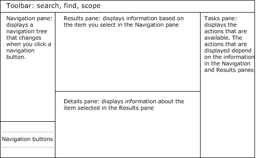
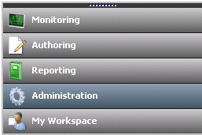

# Comparing the Operations Console and Web Console in Operations Manager
[!INCLUDE[om12long](../../om/manage/includes/om12long_md.md)] operators use a console to view monitoring data. The consoles available are the Operations console and the web console. The Operations console allows you to perform all actions that your user role allows, while the web console displays only My Workspace and the Monitoring workspace.  
  
Both consoles share a similar layout:  
  
  
  
Each navigation button opens a specific workspace, such as Monitoring or Administration. In the Operations console, the following navigation buttons may be available, depending on the user role you are assigned:  
  
  
  
In the web console, only Monitoring and My Workspace are available:  
  
  
  
> [!TIP]  
> In the Operations console, you can change the navigation buttons into small icons and increase the space available in the navigation pane by clicking on the top border of the navigation buttons and dragging downward. You can also hide and reveal the navigation and task panes.  
  
There are a few differences between the Operations console and web console that you should be aware of:  
  
-   There are minor differences in sort. For example, in the web console, when you sort alerts, only the alerts visible on the page are sorted rather than all alerts.  
  
-   Fewer alerts display per page in the web console.  
  
-   You cannot run tasks that require elevated access in the web console.  
  
-   You do not have the options to show, hide, personalize, or create views in the web console, although you can create a dashboard view in My Workspace in the web console.  
  
-   There are no subscription options in the web console.  
  
