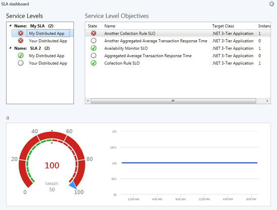

# Creating a Service Level Dashboard
After you configure a service level objective, you can create a service level dashboard view to monitor the service level objective. The service level dashboard view displays a grid of service levels and a grid of service level objectives grid which lists the various objectives which have a goal or target value and whether success is either above or below that target value for the currently selected SLA\/instance. When you select an objective in the **Service Level Objectives** grid, a gauge and chart is displayed, as shown in the following image.  
  
  
  
The gauge will show the average actual value, along with the target value and a indication as to whether the value and goal relationship corresponds to success \(green\) or failure \(red\). The chart will show a time history of the actual values, which will be a function of the aggregation of the values in the data warehouse, which will depend on the timeframe of the configured dashboard, as to whether the values come from the Hourly or Daily aggregation table.  
  
### To create a service level dashboard view  
  
1.  In the Operations console, click **My Workspace**.  
  
2.  Right\-click the folder where you want to store the view, point to **New**, and click **Dashboard View**.  
  
3.  In the New Instance Wizard, on the **Template** page, click either **Flow Layout** or **Grid Layout**, and then click **Next**.  
  
4.  On the **General Properties** page, enter a name for the dashboard view. The description is optional. Click **Next**.  
  
5.  On the **Specify the Scope** page, click **Add**.  
  
6.  In the **Add SLA** window, select the service level objective that you created, click **Add**, and then click **OK**. You can add multiple service level objectives.  
  
7.  On the **Specify the Scope** page, in the **Last** section, set the period of time that you want to display in the dashboard view, and then click **Next**.  
  
8.  Review the settings on the **Summary** page, and then click **Create**.  
  
9. Click **Close**.  
  
## See Also  
[Monitoring Service Level Objectives by Using Operations Manager](../../om/manage/Monitoring-Service-Level-Objectives-by-Using-Operations-Manager.md)  
[Defining a Service Level Objective Against an Application](../../om/manage/Defining-a-Service-Level-Objective-Against-an-Application.md)  
[Defining a Service Level Objective Against a Group](../../om/manage/Defining-a-Service-Level-Objective-Against-a-Group.md)  
  
