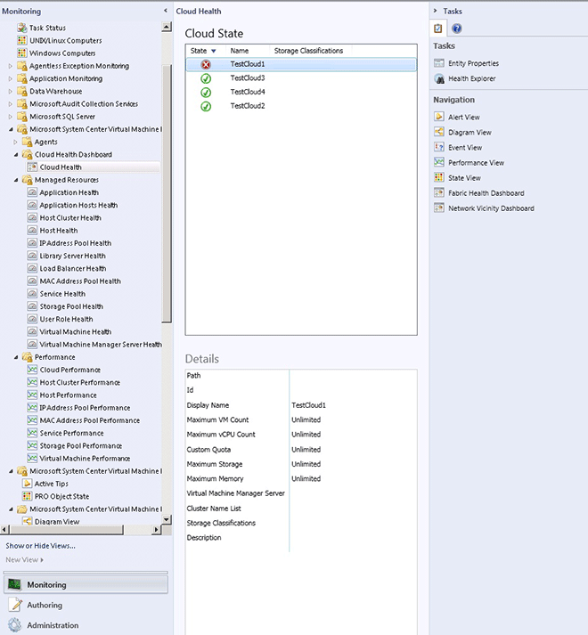
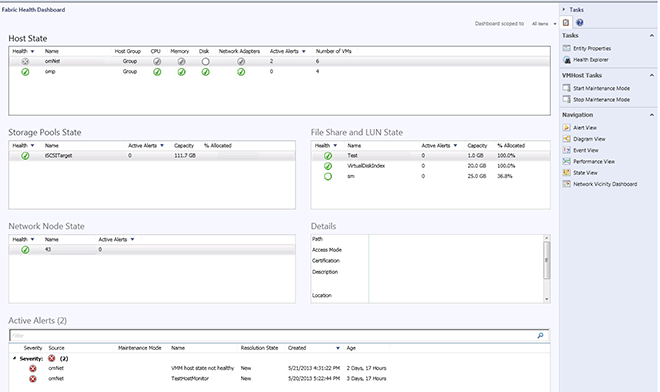

# Getting Started with the Fabric Health Dashboard
The Fabric Health Dashboard shows a detailed overview of the health of your private clouds and the fabric that services them. The dashboard helps you answer questions like “What is the health of my clouds and the fabric serving those clouds?” You can see the overall cloud health, health across host, storage, and network components, active alerts related to that cloud, and drill down into other dashboards for views to help you resolve problems. Essentially, you can quickly see the fabric health of the components you care about and determine whether you have an urgent issue that needs fixing.  
  
## About the Fabric Health Dashboard  
  
#### To view the Fabric Health Dashboard  
  
1.  Before you can begin to monitor the fabric of your private clouds, you must integrate [!INCLUDE[omblue_1](../../om/manage/includes/omblue_1_md.md)] and Virtual Machine Manager. For more information, see [Configuring Operations Manager Integration with VMM](http://go.microsoft.com/fwlink/?LinkId=325587). During the integration, the management pack for VMM Fabric Dashboard 2012 R2 is imported automatically.  
  
2.  To view the Fabric Health Dashboard, after you integrate [!INCLUDE[omblue_1](../../om/manage/includes/omblue_1_md.md)] and Virtual Machine Manager, click **Monitoring**, and in **Cloud Health Dashboard**, click **Cloud Health**.  
  
3.  In the **Cloud State** view, select the cloud you want to investigate.  
  
      
  
4.  In the **Tasks** pane, click **Fabric Health Dashboard**. From here, you get to other dashboards and other information to investigate issues across the areas that the Fabric Health Dashboard displays.  
  
  
  
**For each cloud, the Fabric Health Dashboard displays these aspects of the fabric:**  
  
-   **Host State:** monitors the health state of the hosting groups or the computing aspects of the cloud, such as CPU, memory, disks, and network adapters  
  
-   **Storage Pools State File Share and LUN State:** monitors the health state of the storage aspect of fabric for issues, such as disk space capacity and allocation  
  
-   **Network Node State:** utilizes network monitoring in Operations Manager and displays the health state of network nodes \(devices\) that are relevant for the cloud you selected. Only physical network devices within one hop from the hosts are shown. To see the physical network devices, you must enable the Network Monitoring feature of [!INCLUDE[om12short](../../om/manage/includes/om12short_md.md)] and monitor the physical network devices connected to the hosts. Virtual networks are not shown in the dashboard.  
  
The **Active Alerts** and **Number of VMs** fields on this dashboard help indicate which issues are having the greatest impact on your cloud and can help you prioritize your work.  
  
**More on fabric monitoring**  
  
-   [Monitoring a Private Cloud \- video series](https://curah.microsoft.com/217123/monitoring-a-private-cloud-video-series)  
  
-   [How Healthy is Your Cloud? Fabric Monitoring Can Tell...](http://curah.microsoft.com/42340/how-healthy-is-your-cloud-fabric-monitoring-can-tell)  
  
