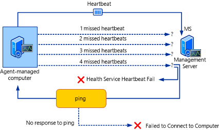
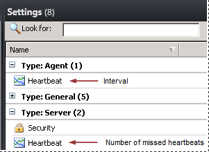

# How Heartbeats Work in Operations Manager
[!INCLUDE[om12long](../../om/manage//om12long_md.md)] uses *heartbeats* to monitor communication channels between an agent and the agent’s primary management server. A heartbeat is a packet of data sent from the agent to the management server on a regular basis, by default every 60 seconds, using port 5723 \(UDP\).  
  
When an agent fails to send a heartbeat 4 times, a **Health Service Heartbeat Failure** alert is generated and the management server attempts to contact the computer by using ping. If the computer does not respond to the ping, a **Failed to Connect to Computer** alert is generated. The following illustration shows this process.  
  
  
  
When you see both alerts, you know the computer cannot be contacted by the management server. When you see only the heartbeat failure alert, you know the computer can be contacted but there is a problem with the agent. Both alerts are closed automatically when heartbeats resume.  
  
> [!NOTE]  
> By default, alerts for missed heartbeats and response to ping are disabled for client operating systems. To receive alerts for client operating systems, override the **Health Service Heartbeat Failure** and **Computer Not Reachable** monitors for the class **Windows Client Operating System** to set the **Generates Alert** parameter to **True**.  
  
The health state for the agent\-managed computer will change to critical \(red\) when the **Health Service Heartbeat Failure** alert is generated. To view details for the health state, right\-click the computer in **Active Alerts**, point to **Open**, and click **Health Explorer**. The Availability node will be expanded to display the critical item. Click **Health Service Heartbeat Failure**, and then click the **State Change Events** tab. You will see a list of state changes with the date and time of occurrence. Select any occurrence to display information in the **Details** pane. The health state will change to healthy \(green\) when heartbeats resume.  
  
You can change the heartbeat interval for all agents and number of missed heartbeats for all management servers in **Settings** in the **Administration** workspace, as shown in the following illustration.  
  
  
  
You can also override the global heartbeat interval for individual agents and the number of missed heartbeats for individual management servers by opening the properties for the computer in **Agent Managed** or **Management Servers** in the **Administration** workspace. For example, you might increase the heartbeat interval for a computer that has a slow connection to the network.  
  
## See Also  
[Resolving Heartbeat Alerts](../../om/manage/Resolving-Heartbeat-Alerts.md)  
[How an Alert is Produced](../../om/manage/How-an-Alert-is-Produced.md)  
[Viewing Active Alerts](../../om/manage/Viewing-Active-Alerts.md)  
[Viewing Alert Details](../../om/manage/Viewing-Alert-Details.md)  
[Examining Properties of Alerts, Rules, and Monitors](../../om/manage/Examining-Properties-of-Alerts--Rules--and-Monitors.md)  
[Impact of Closing an Alert](../../om/manage/Impact-of-Closing-an-Alert.md)  
[How to Close an Alert Generated by a Monitor](../../om/manage/How-to-Close-an-Alert-Generated-by-a-Monitor.md)  
[How to Reset Health](../../om/manage/How-to-Reset-Health.md)  
[Identifying the Computer Experiencing a Problem](../../om/manage/Identifying-the-Computer-Experiencing-a-Problem.md)  
[Using Health Explorer to Investigate Problems](../../om/manage/Using-Health-Explorer-to-Investigate-Problems.md)  
[Using Event View to Investigate Problems](../../om/manage/Using-Event-View-to-Investigate-Problems.md)  
[Investigating Alert Storms](../../om/manage/Investigating-Alert-Storms.md)  
[How to View All Rules and Monitors Running on an Agent-Managed Computer](../../om/manage/How-to-View-All-Rules-and-Monitors-Running-on-an-Agent-Managed-Computer.md)  
[How to Set Alert Resolution States](../../om/manage/How-to-Set-Alert-Resolution-States.md)  
[How to Configure Automatic Alert Resolution](../../om/manage/How-to-Configure-Automatic-Alert-Resolution.md)  
[Viewing and Investigating Alerts for .NET Applications &#40;Server-side Perspective&#41;](../../om/manage/Viewing-and-Investigating-Alerts-for-.NET-Applications--Server-side-Perspective-.md)  
[Diagnostic and Recovery Tasks](../../om/manage/Diagnostic-and-Recovery-Tasks.md)  
  
