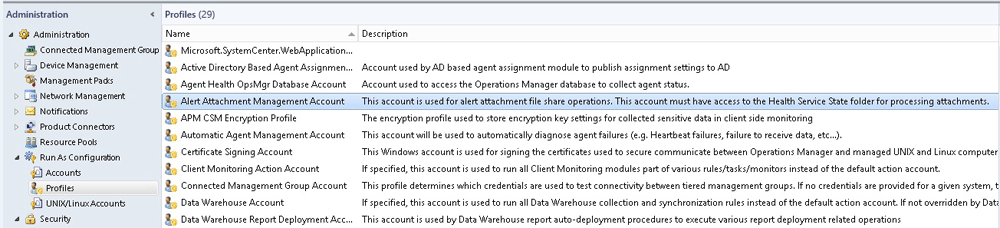
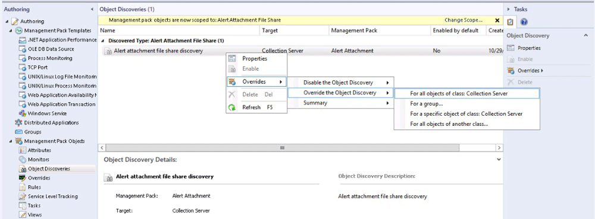
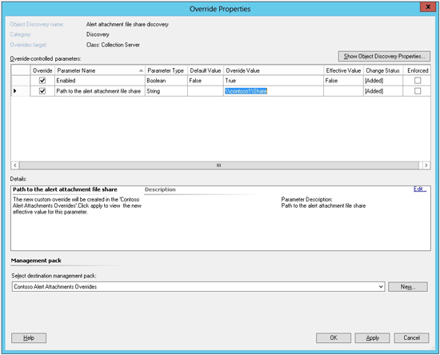

# How to Configure File Attachments for Operations Manager Alerts in System Center 2012 SP1
[!INCLUDE[sc2012sp1notetopic](../../om/manage/includes/sc2012sp1notetopic_md.md)]  
  
Some management packs for [!INCLUDE[om12short](../../om/manage/includes/om12short_md.md)] attach additional information to alerts. This information is stored as files on the network share, and it is updated by workflows that run on the management servers. Only management servers write to this network share. Other computers in the management group can add attachments to alerts. They do so by uploading files to the management server first. Therefore, these other computers do not need direct access to the file share. Files are uploaded to the management server using the same secure [!INCLUDE[om12short](../../om/manage/includes/om12short_md.md)] channel that agents use to communicate with the management servers. A separate Run As profile controls the credentials that the management servers use to access the network file share.  
  
> [!IMPORTANT]  
> As a preliminary action, you must configure file attachments for [!INCLUDE[om12short](../../om/manage/includes/om12short_md.md)] alerts in [!INCLUDE[sc2012sp1_long](../../om/manage/includes/sc2012sp1_long_md.md)]. This will enable integration with Team Foundation Server \(TFS\), IntelliTrace Historical Profiling, sharing Application Performance Monitoring events with developers, Global Service Monitor web tests, and any other scenarios that require files to be associated with [!INCLUDE[om12short](../../om/manage/includes/om12short_md.md)] alerts.  
  
### To configure file attachments for Operations Manager alerts  
  
1.  Create an Alert Attachment network file share with enough space to accommodate your anticipated storage needs.  
  
    > [!IMPORTANT]  
    > Some alert attachments can be very large. For example, a typical production IntelliTrace Historical Profiling snapshot might be several hundred megabytes \(MB\). Make sure you allocate enough storage space to meet your business needs.  
  
2.  Create an active directory account that has read\/write permission to the Alert Attachment network file share. Make this account a local administrator on each management server that you plan to use for synchronizing with Team Foundation Server. Make sure that the disk space quota on the network file share does not restrict this account from writing a large amount of information. This account will be used to retrieve the files that are uploaded to the management server and will place those files on the Alert Attachment network file share.  
  
3.  In the [!INCLUDE[om12short](../../om/manage/includes/om12short_md.md)] console, click the **Administration** button, click **Management Packs**, and then in the **Tasks** pane, click **Import Management Packs**. In the Import Management Packs Wizard, click **Add**, and then click **Add from disk**. Import the Alert Attachment Management Pack \(Microsoft.SystemCenter.AlertAttachment.mpb\) from the ManagementPacks folder on the [!INCLUDE[sc2012sp1_short](../../om/manage/includes/sc2012sp1_short_md.md)][!INCLUDE[om12short](../../om/manage/includes/om12short_md.md)] installation media. Click **Install**, and then click **Close**.  
  
4.  Configure the Run As profile to use the account that you created for file attachments. In the [!INCLUDE[om12short](../../om/manage/includes/om12short_md.md)] console, click **Administration**, expand **Run As Configuration**, and then click **Profiles**. Double\-click **Alert Attachment Management Account**. Locate and configure the Alert Attachment Management Account for all targeted objects. For more information about using Run As profiles, see [Managing Run As Accounts and Profiles](../../om/manage/Managing-Run-As-Accounts-and-Profiles.md).  
  
    **The location of the Alert Attachment Management Account to be configured**  
  
      
  
5.  Enable the Alert Attachment discovery rule, and configure the override to point to the Alert Attachment file share location. In the [!INCLUDE[om12short](../../om/manage/includes/om12short_md.md)] console, click **Authoring**, expand **Management Pack Objects**, and then click **Object Discoveries**. To set the object discovery scope, click **Scope**, and then click **View all targets**. Locate and select **Alert Attachment File Share**. Click **OK**.  
  
    In the list of scoped objects, expand **Discovered Type: Alert Attachment File Share**, right\-click **Alert attachment file share discovery**, click **Overrides**, click **Override the Object Discovery**, and then click **For all objects of class: Collection Server**.  
  
    **Override menus**  
  
      
  
    On the **Override Properties** page, set **Enabled** to **True**, and then set **Path to the alert attachment file share** to the location of the network file share you created.  
  
    > [!IMPORTANT]  
    > You must specify the **Path to the alert attachment file share** in Uniform Naming Convention \(UNC\) format. For example, this is a valid format: \\\\contoso1\\share. You cannot use a path to a hard drive, such as C:\\AttachmentFiles.  
  
    In the **Management pack** section, select a target management pack or create a new management pack to save the override values. For more information, see [Applying Overrides to Object Discoveries](../Topic/Applying%20Overrides%20to%20Object%20Discoveries.md).  
  
    **Override Properties page**  
  
      
  
