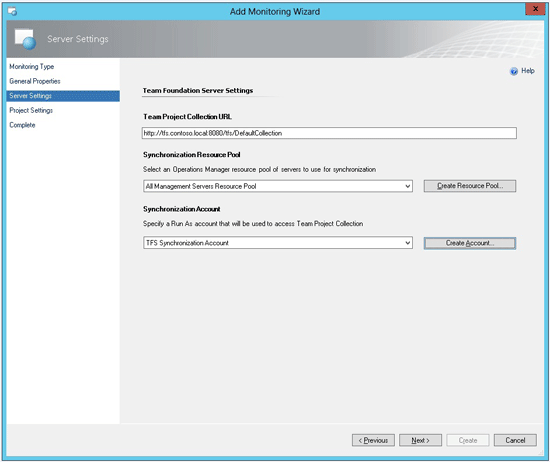
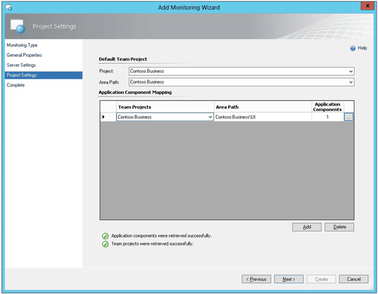

# How to Configure Integration with TFS in System Center 2012 SP1
[!INCLUDE[sc2012sp1notetopic](../../om/manage/includes/sc2012sp1notetopic_md.md)]  
  
If you need to synchronize with [!INCLUDE[sc2012](../../om/manage/includes/sc2012_md.md)] without Service Pack 1 \(SP1\), you can use TFS Work Item Synchronization Management Pack for Team Foundation Server \(TFS\) 2010. To download the management pack and the guide, see [System Center Management Pack for Microsoft Visual Studio Team Foundation Server 2010 Work Item Synchronization](http://go.microsoft.com/fwlink/p/?LinkId=271476).  
  
In [!INCLUDE[sc2012sp1_short](../../om/manage/includes/sc2012sp1_short_md.md)], you can synchronize [!INCLUDE[om12short](../../om/manage/includes/om12short_md.md)] alerts and TFS work items. After enabling synchronization, information technology \(IT\) operations can assign alerts to the engineering team. When you first assign an alert to engineering, TFS creates a new work item. The workflow then tracks and synchronizes changes that are made to TFS work items and changes that are made to associated [!INCLUDE[om12short](../../om/manage/includes/om12short_md.md)] alerts. You can synchronize alerts with team projects in TFS 2012, TFS 2010, or both.  
  
> [!IMPORTANT]  
> Before you enable configuration, you must have TFS administrator credentials to be able to import the Operational Issue Work Item Type Definition that is used by integration with TFS. Additionally, you must have a configured domain account with TFS contributor rights in the team projects that you want to synchronize [!INCLUDE[om12short](../../om/manage/includes/om12short_md.md)] alerts with.  
  
### To prepare your environment for synchronization with TFS  
  
1.  Import and configure the Alert Attachment Management Pack. For more information, see [How to Configure File Attachments for Operations Manager Alerts in System Center 2012 SP1](../../om/manage/How-to-Configure-File-Attachments-for-Operations-Manager-Alerts-in-System-Center-2012-SP1.md).  
  
2.  Decide which management servers you want to use to synchronize [!INCLUDE[om12short](../../om/manage/includes/om12short_md.md)] alerts and TFS work items. Each management server that is used for synchronization must have TFS Object Model installed. You can install the TFS Object Model for TFS 2010 from the MSDN Download Center \([Team Foundation Server 2010 SP1 Object Model Installer](http://go.microsoft.com/fwlink/p/?LinkID=239918)\) or by installing the TFS Object Model for TFS 2012 from the MSDN Download Center \([Team Foundation Server 2012 Update 1 Object Model Installer](http://go.microsoft.com/fwlink/?LinkId=275135)\). You can also install the TFS Object Model for TFS 2012 when you install Visual Studio 2012. Installing TFS on a server also installs the TFS Object Model on that server.  
  
    > [!IMPORTANT]  
    > You can use TFS Object Model 2010 or TFS Object Model 2012 for synchronization with TFS. TFS Object Model 2013 is not currently compatible with the version of synchronization released with [!INCLUDE[omblue_1](../../om/manage/includes/omblue_1_md.md)]. To synchronize with TFS 2013, you need to install TFS Object Model 2012. However, in order to synchronize with TFS 2012 using TFS Object Model 2010, you must manually import the Operational Issue work item type definition \(WITD\) into each team project that will be used for synchronization. Do this by using the **witadmin** command\-line tool. For more information about manually importing the Operational Issue WITD, see [How to Manually Import an Operational Issue WITD to TFS in System Center 2012 SP1](../../om/manage/How-to-Manually-Import-an-Operational-Issue-WITD-to-TFS-in-System-Center-2012-SP1.md).  
  
    > [!TIP]  
    > Installing synchronization on all management servers in the management group will help to simplify maintenance and bring redundancy into the integration between [!INCLUDE[om12short](../../om/manage/includes/om12short_md.md)] and TFS.  
  
3.  Create a domain account that will be used for TFS synchronization.  
  
4.  Give this domain account TFS contributor permissions for each project that you plan to use for TFS synchronization. For more information, see [Add Users to Team Projects](http://go.microsoft.com/fwlink/p/?LinkId=271481).  
  
5.  If you intend to synchronize alert file attachments with TFS work items, give this account read\/write access to the Alert Attachment file share. This is the file share that was established when you configured the Alert Attachment Management Pack.  
  
### To configure synchronization for the TFS Work Item Synchronization Management Pack  
  
1.  Import the TFS Work Item Synchronization Management Pack from the [!INCLUDE[om12short](../../om/manage/includes/om12short_md.md)] installation media. In the [!INCLUDE[om12short](../../om/manage/includes/om12short_md.md)] console, click **Administration**, click **Management Packs**, and then, in the **Tasks** pane, click **Import Management Packs**. In the Import Management Packs Wizard, click **Add**, and then click **Add from disk**. Import the TFS Work Item Synchronization Management Pack \(Microsoft.SystemCenter.TFSWISynchronization.mpb\) from the ManagementPacks folder on the [!INCLUDE[om12short](../../om/manage/includes/om12short_md.md)] installation media. Click **Install**, and then click **Close**.  
  
2.  To begin configuring the TFS Work Item Synchronization Management Pack, in the [!INCLUDE[om12short](../../om/manage/includes/om12short_md.md)] console, in the navigation pane, click **Authoring**, click **Management Pack Templates**, and then, in the **Tasks** pane, click **Add Monitoring Wizard**.  
  
    > [!IMPORTANT]  
    > You must run the Add Monitoring Wizard for each team project collection that you want to synchronize alerts with.  
  
3.  To open the TFS Work Item Synchronization template, in the Add Monitoring Wizard, on the **Monitoring Type** page, select **TFS Work Item Synchronization**.  
  
4.  On the **General Properties** page, type a display name for this team project collection and a description, and then select a target management pack to store your configuration settings.  
  
5.  On the **Server Settings** page, enter the **Team Project Collection URL** \(for example: http:\/\/tfs.contoso.local:8080\/tfs\/DefaultCollection\/\), and then select the **Synchronization Resource Pool** of the management servers that are used for load\-balancing synchronization. Each server in this resource pool must already have the TFS Object Model installed. Then, create or select a Run As account that will be used for synchronization. This Run As account must have contributor permissions in each TFS team project. If you want to synchronize alert file attachments, the Run As account must have read\/write access to the Alert Attachment file share. Make sure that these credentials are distributed to all management servers that are used for synchronization. For more information about using Run As profiles, see [Managing Run As Accounts and Profiles](../../om/manage/Managing-Run-As-Accounts-and-Profiles.md).  
  
    > [!NOTE]  
    > You can get the TFS Team Project Collections URL from the Team Foundation Server Administration Console. If the TFS Team Project Collection that you choose is offline or otherwise unavailable, the wizard will warn you, but it will still let you finish the configuration. Additionally, when TFS is not available, there is no validation for your input in the wizard. The team project and area path will not be prepopulated with existing values.  
  
    **Server Settings page**  
  
      
  
6.  On the **Project Settings** page, specify the **Project** and **Area Path** that will be used to synchronize all alerts. You can customize these settings for each .NET application component that was previously configured for monitoring with .NET Application Performance Monitoring \(APM\). To customize the team project and TFS area path for an APM component, click **Add**, which will add a new row. Choose a target **Team Project** and **Area Path** combination, and then click the \(**…**\) button to select which configured application components will synchronize with this team project and area path. The application components must already be configured for monitoring with the .NET Application Performance Monitoring template. For more information, see [.NET Application Performance Monitoring Template](../Topic/.NET%20Application%20Performance%20Monitoring%20Template.md).  
  
    **Project Settings page**  
  
      
  
    > [!NOTE]  
    > You can configure synchronization with multiple Team Foundation Servers or multiple Team Project Collections by running the configuration wizard multiple times. However, only one configuration can have the **Default Team Project** and **Default Area Path** specified.  
  
7.  When you finish the wizard, you will be asked for TFS administrator credentials so that the wizard can automatically import the Operational Issue WITD to each team project that is used in the configured synchronization. You can skip this step if you want to manually import the Operational Issue WITD. You must manually import the WITD when you are synchronizing with Team Foundation Server 2012 using TFS Object Model 2010. For more information, see [How to Manually Import an Operational Issue WITD to TFS in System Center 2012 SP1](../../om/manage/How-to-Manually-Import-an-Operational-Issue-WITD-to-TFS-in-System-Center-2012-SP1.md).  
  
    > [!NOTE]  
    > After you configure synchronization, the TFS Work Item Synchronization management pack will monitor the synchronization infrastructure, and it will generate alerts if synchronization fails. However, to monitor the complete TFS infrastructure, you need additional monitoring packs that can alert you about a wide range of potential problems with TFS components. When you import the TFS Work Item Synchronization management pack, you should also import and configure these monitoring packs. Together, they help you make sure that you are monitoring the complete health of the developer TFS environment. For more information, see [Monitoring Integration between Operations Manager and TFS in System Center 2012 SP1](../../om/manage/Monitoring-Integration-between-Operations-Manager-and-TFS-in-System-Center-2012-SP1.md).  
  
## Changing Synchronization Settings  
You can view or change synchronization settings for the TFS Work Item Synchronization Management Pack. You will need to change these settings to modify a destination team project and area path or to customize synchronization rules for a monitored .NET application component.  
  
To prevent inconsistent synchronization while new settings are being applied, turn off synchronization before you change the configuration. For information about stopping and resuming synchronization, see [How to Stop and Resume Synchronization with TFS in System Center 2012 SP1](../../om/manage/How-to-Stop-and-Resume-Synchronization-with-TFS-in-System-Center-2012-SP1.md). The process of replicating configuration changes to all management servers in the synchronization pool might take an hour or more, depending on the system performance of your management group. After the replication is complete, you can turn synchronization on again. If the configuration was changed while synchronization was running, you might have to force a reset of the configuration by restarting the System Center Management Service on all management servers in the synchronization pool.  
  
If you change a destination team project for synchronization, the rules in the following table apply.  
  
|Changes in TFS team project location|How synchronization is affected|  
|----------------------------------------|-----------------------------------|  
|An application is mapped to a new TFS project within the same TFS project collection.|New alerts go to the new project and old alerts keep synchronizing with the old project. If you delete old ticket IDs and reassign the related alerts to engineering, new work items are created in the new project. These new work items are not linked to any of the pre\-existing work items.|  
|An application is mapped to a new TFS project within the same TFS server, but in a different TFS project collection.|New alerts go to the new TFS project. The old alerts stop synchronizing completely. If you delete old ticket IDs and reassign the related alerts to engineering, new work items are created. These new work items are not linked to any of the pre\-existing work items.|  
|An application is mapped to a project on a different server.|New work items are created for alerts that are newly assigned to engineering. Synchronization of any previously synchronized alerts stops.|  
  
#### To change synchronization settings  
  
1.  To change synchronization settings, in the [!INCLUDE[om12short](../../om/manage/includes/om12short_md.md)] console, in the navigation pane, click **Authoring**, expand **Management Pack Templates**, and then click **TFS Work Item Synchronization**.  
  
2.  Locate a previously configured team project collection, and in the **Tasks** pane, click **Properties**.  
  
    > [!NOTE]  
    > If you recently changed configuration and the change has not been replicated to the management servers, you must wait for the changes to be replicated before you can view and work with the new configuration. The replication of configuration changes to all management servers in the synchronization pool might take an hour or more, depending on the system performance of your management group.  
  
3.  On the **Server Settings** tab, you can change the **Synchronization Resource Pool** of the management servers that are used for load\-balancing synchronization. Each server in this resource pool must already have the TFS Object Model installed. Also, you can change the Run As account that will be used for synchronization. This account must have contributor permissions in each TFS team project, and, if you want to synchronize alert file attachments, the account must have read\/write access to the Alert Attachment file share. Make sure that these credentials are distributed to all management servers that are used for synchronization. For more information about using Run As profiles, see [Managing Run As Accounts and Profiles](../../om/manage/Managing-Run-As-Accounts-and-Profiles.md).  
  
    > [!NOTE]  
    > If you need to change the Team Project Collection URL, you must delete the configuration and run the wizard again.  
  
4.  On the **Project Settings** tab, specify the **Default Team Project** and **Default Area Path** that will be used to synchronize all alerts. You can customize these settings for each .NET application component that was previously configured for monitoring with .NET Application Performance Monitoring \(APM\). To customize the team project and TFS area path for an APM component, click **Add** to add a new row. Choose a target **Team Project** and **Area Path** combination, and then click the \(**…**\) button to select which configured application components will synchronize with this team project and area path. The application components must already be configured for monitoring with the .NET Application Performance Monitoring template. For more information, see [.NET Application Performance Monitoring Template](../Topic/.NET%20Application%20Performance%20Monitoring%20Template.md).  
  
    > [!NOTE]  
    > To configure synchronization with multiple Team Foundation Servers or multiple Team Project Collections, you can run the configuration wizard multiple times. However, only one configuration can have the **Default Team Project** and **Default Area Path** specified.  
  
5.  Click **OK**.  
  
6.  If you added a new team project to synchronize with, you will be asked for TFS administrator credentials so that the wizard can automatically import the Operational Issue WITD to the new team project that is used in the configured synchronization. You can skip this step if you want to manually import the Operational Issue WITD. You must manually import the WITD when you are synchronizing with TFS 2012 using TFS Object Model 2010. For more information, see [How to Manually Import an Operational Issue WITD to TFS in System Center 2012 SP1](../../om/manage/How-to-Manually-Import-an-Operational-Issue-WITD-to-TFS-in-System-Center-2012-SP1.md).  
  
**Procedures Related to Configuring Integration with TFS**  
  
For additional information, see the following procedures related to configuring integration with TFS in [!INCLUDE[sc2012sp1_long](../../om/manage/includes/sc2012sp1_long_md.md)]:  
  
-   [How to Change the Frequency of Synchronization for Integration with TFS in System Center 2012 SP1](../../om/manage/How-to-Change-the-Frequency-of-Synchronization-for-Integration-with-TFS-in-System-Center-2012-SP1.md)  
  
-   [How to Manually Import an Operational Issue WITD to TFS in System Center 2012 SP1](../../om/manage/How-to-Manually-Import-an-Operational-Issue-WITD-to-TFS-in-System-Center-2012-SP1.md)  
  
-   [How to Configure Whether Files Are Attached or Linked in Synchronization with TFS in System Center 2012 SP1](../../om/manage/How-to-Configure-Whether-Files-Are-Attached-or-Linked-in-Synchronization-with-TFS-in-System-Center-2012-SP1.md)  
  
-   [How to Configure Notifications when Developers Reassign Work Items to IT Operations in System Center 2012 SP1](../../om/manage/How-to-Configure-Notifications-when-Developers-Reassign-Work-Items-to-IT-Operations-in-System-Center-2012-SP1.md)  
  
-   [How to Automatically Assign New Alerts to Engineering in System Center 2012 SP1](../../om/manage/How-to-Automatically-Assign-New-Alerts-to-Engineering-in-System-Center-2012-SP1.md)  
  
-   [How to Automatically Close Alerts When Work Items Are Resolved in TFS in System Center 2012 SP1](../../om/manage/How-to-Automatically-Close-Alerts-When-Work-Items-Are-Resolved-in-TFS-in-System-Center-2012-SP1.md)  
  
-   [How to Stop and Resume Synchronization with TFS in System Center 2012 SP1](../../om/manage/How-to-Stop-and-Resume-Synchronization-with-TFS-in-System-Center-2012-SP1.md)  
  
