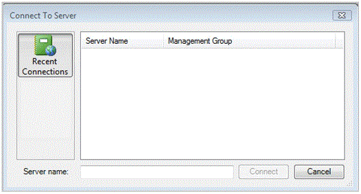
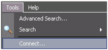

# How to Connect to the Operations Console
The [!INCLUDE[om12long](../../om/manage/includes/om12long_md.md)] Operations console can be installed on any computer that meets the [system requirements](http://go.microsoft.com/fwlink/?LinkID=%20212502). When you open the Operations console on a management server, the console connects to that management server, however you can use the following procedure to connect to a different management server. When you initially open the Operations console on a computer that is not a management server, you must specify the management server to connect to. The following image shows the **Connect To Server** dialog box.  
  
  
  
### To connect an Operations console to a management server  
  
1.  Click **Start**, click **All Programs**, click **System Center Operations Manager 2012**, and click **Operations Console** to open the Operations console.  
  
2.  In the **Connect To Server** dialog box, type in the server name or select a server from the list. \(In the image above, the console has not yet connected to any management group. If the console has previously connected to any management servers, the servers will be listed in **Recent Connections**.\)  
  
The Operations console opens with the focus on the most recently viewed workspace. For example, if the Authoring workspace is selected when the console is closed, the next time that the console is started, it will open to the Authoring workspace. To switch to a different workspace, click the appropriate navigation button.  
  
### To change the management server that the Operations console is connected to  
  
-   In the Operations console, click **Tools** and then click **Connect** as shown in the following image, which will open the **Connect To Server** window.  
  
      
  
## See Also  
[Comparing the Operations Console and Web Console in Operations Manager](../../om/manage/Comparing-the-Operations-Console-and-Web-Console-in-Operations-Manager.md)  
[Connecting Management Groups in Operations Manager](../../om/manage/Connecting-Management-Groups-in-Operations-Manager.md)  
[Using the Reporting Workspace in Operations Manager](../../om/manage/Using-the-Reporting-Workspace-in-Operations-Manager.md)  
[Using the Administration Workspace in Operations Manager](../../om/manage/Using-the-Administration-Workspace-in-Operations-Manager.md)  
[Using My Workspace in Operations Manager](../../om/manage/Using-My-Workspace-in-Operations-Manager.md)  
[Using Health Explorer in Operations Manager](../../om/manage/Using-Health-Explorer-in-Operations-Manager.md)  
[Using the Monitoring Workspace in Operations Manager](../../om/manage/Using-the-Monitoring-Workspace-in-Operations-Manager.md)  
[How to Connect to the Web Console](../../om/manage/How-to-Connect-to-the-Web-Console.md)  
[Using the Authoring Workspace in Operations Manager](../../om/manage/Using-the-Authoring-Workspace-in-Operations-Manager.md)  
[Using the Operations Manager Consoles](../../om/manage/Using-the-Operations-Manager-Consoles.md)  
  
