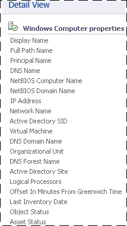

# How to Create Groups in Operations Manager
You can use groups in [!INCLUDE[om12long](../../om/manage/includes/om12long_md.md)] to scope views, reports, overrides, and alert notifications. You create groups in the **Authoring** workspace in the Operations console.  
  
In the Operations console, you can only create instance groups. The difference between instance groups and computers groups is:  
  
-   An instance group is populated with objects that match your criteria.  
  
-   A computer group is populated by computers that host objects that match your criteria.  
  
To create a group based on a hosting relationship, such as all computers that are running SQL Server, you must use the Authoring console or work directly in the XML of a management pack.  
  
The most common objects you will place in your groups are **Windows Computer** objects.  The most common way to dynamically assign computers to the groups is by using a *property* of the **Windows Computer** class. For example, **Organizational Unit** is a property of the **Windows Computer** class, so you can create a group that makes all computers in a specific organizational unit members of the same group. The following image shows the properties of an object in the **Windows Computer** class, which you can view in the details pane of the **Monitoring** workspace by selecting the **Windows Computers** state view.  
  
  
  
You can assign both explicit and dynamic members in the same group definition, and you can exclude explicit members. For examples of dynamic group queries and formulas, see [Operations Manager Dynamic Group Examples](http://go.microsoft.com/fwlink/p/?LinkId=242241).  
  
### To create a group in [!INCLUDE[om12short](../../om/manage/includes/om12short_md.md)]  
  
1.  Log on to the computer with an account that is a member of the Operations Manager Administrators role.  
  
2.  In the Operations console, click **Authoring**.  
  
3.  Right\-click **Groups**, and then click **Create a new Group** to start the Create Group Wizard.  
  
4.  On the **Enter a name and description for the new group** page, do the following:  
  
    1.  Type the **Name** for the group.  
  
    2.  Optionally, type the **Description** for the group. A description of the group membership makes it easier to select the right group for views, overrides, and so forth.  
  
    3.  Select a **destination management pack** from the list, or click **New** to create a management pack with the Create a Management Pack Wizard.  
  
    4.  Click **Next**.  
  
5.  On the **Explicit Members** \- **Choose Members from a List**  page, you can add explicit objects to the group or click **Next** to continue to the **Dynamic Members** configuration. To add explicit group members, click **Add\/Remove Objects** and then perform the following steps:  
  
    1.  In the **Search for** list, select an object type, such as **Windows Computer**.  
  
    2.  Optionally, in the **Filter by part of the name** box, type all or part of the object name, and then click **Search**.  
  
    3.  In the **Available items** box, select the desired objects, click **Add**, and then click **Next**.  
  
6.  On the **Dynamic Members** \- **Create a Membership Formula** page, you can add a dynamic membership formula to the group or click **Next** to continue to the **Subgroups** page. To add a dynamic membership formula, click **Create\/Edit rules** and then perform the following steps:  
  
    > [!WARNING]  
    > This procedure tells you how to create a query for Windows computers based on NetBIOS computer name.  
  
    1.  In the **Query Builder** dialog box, leave the default **Windows Computer** and click **Add**.  
  
    2.  In the **Property** list, select **NetBIOS computer name**.  
  
    3.  In the **Operator** list, select **Contains**.  
  
    4.  Set **Value** to part of the name of the computers you want in the group, such as **NY** or **MKTG**.  
  
        > [!NOTE]  
        > Click **Insert** to add an **Expression** or group expressions with **OR** or **AND** operators. Repeat the preceding steps to add additional object types to the rule.  
  
    5.  Click **OK**, review the **Query formula**, and then click **Next**.  
  
7.  On the **Choose Optional Subgroups** page, either click **Next** to not add groups to the group, or click **Add\/Remove Subgroups** to add groups, for example.  
  
    1.  In the **Group Selection** dialog box, in **Filter by part of name**, you can optionally type part or the all of the group's names, and then click **Search**.  
  
    2.  In the **Available items** text box, select the desired groups, click **Add**, click **OK**, and then click **Next**.  
  
8.  On the **Excluded Members** \- **Specify Exclude List** page, click **Finish** to not exclude objects from the group, or click **Exclude Objects**, and then perform the following steps:  
  
    1.  In the **Object Exclusion** dialog box, from the **Search for** list, select an object type, such as **Windows Computer**.  
  
    2.  Optionally, in the **Filter by part of the name** box, type all or part of the object name, and then click **Search**.  
  
    3.  In the **Available items** text box, select the objects you want to exclude, click **Add**, click **OK**, and then click **Finish**.  
  
    > [!NOTE]  
    > It can take approximately one minute to populate the membership of a group.  
  
## See Also  
[Creating and Managing Groups](../../om/manage/Creating-and-Managing-Groups.md)  
[Define a Scope Using Operations Manager Groups](../../om/manage/Define-a-Scope-Using-Operations-Manager-Groups.md)  
[Using Classes and Groups for Overrides in Operations Manager](../../om/manage/Using-Classes-and-Groups-for-Overrides-in-Operations-Manager.md)  
[How to View Group Members, State, and Diagram](../../om/manage/How-to-View-Group-Members--State--and-Diagram.md)  
[How to Create Subscriptions Using Classes and Groups](../../om/manage/How-to-Create-Subscriptions-Using-Classes-and-Groups.md)  
[Guidance for Scoping and Targeting Views](../../om/manage/Guidance-for-Scoping-and-Targeting-Views.md)  
  
