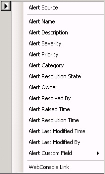

# How to Customize Message Content for Notifications
In [!INCLUDE[om12long](../../om/manage/includes/om12long_md.md)], you can customize the format that will be used for messages that notify you of alerts. The format of an alert notification is determined by the channel by which the notification is sent. Each channel type has a default format, as shown in the following examples.  
  
> [!NOTE]  
> The command channel type is not mentioned because it generates a command rather than a notification message.  
  
|Channel type|Default notification format|  
|----------------|-------------------------------|  
|Email|**Subject**: Alert: *alert name* Resolution state: *new or closed*  Alert:  Source:  Path:  Last modified by:  Last modified time:  Alert description:  Alert view link:  Notification subscription ID generating this message:|  
|Instant message \(IM\)|Alert: *alert name* Path: *path to managed entity* Resolution state: *new or closed* Last modified by:|  
|SMS \(text message\)|Alert: *alert name* Resolution state: *new or closed*|  
  
You can change the format on the **Format** page of the channel type wizard when you create the channel or after the channel is created. The procedure is the same for all three channel types.  
  
### To configure notification format  
  
1.  On the **Format** page of the channel type wizard, in the message box for the channel type \(or subject box for the email channel\), delete any information from the default format that you do not want to include.  
  
2.  Position your cursor in the location of the box where you want to add information.  
  
3.  Type any non\-variable text that you want in the message.  
  
4.  Click the button to the right of the box to display the information you can add to the subject or message for notifications, as shown in the following illustration.  
  
      
  
5.  Click any item in that list to add the corresponding variable to the notification message. For example, if you click **Alert Severity**, the following variable will be added to the box:  
  
    $Data\[Default\='Not Present'\]\/Context\/DataItem\/Severity$  
  
    > [!NOTE]  
    > When a default value for a parameter is included, such as \[Default\=’Not Present’\] in the preceding example, it indicates the text to provide when the alert does not contain data for that parameter.  
  
6.  When you are done, click **Finish**. All notification messages that use the same channel will be formatted the same way.  
  
## Customizing a Channel for a Subscription  
When you create a subscription, you can copy an existing channel that you can customize for that subscription.  
  
#### To customize a channel for a subscription  
  
1.  In the **Notification Subscription Wizard**, on the **Channels** page, click **New**, and then click **Create Customized Copy**.  
  
2.  In the **Channel Search** window, use **Filter by** and **Search** to locate the channel you want to copy. Select the channel in **Available channels**, click **Add**, and then click **OK**.  
  
3.  The notification channel wizard for the selected channel opens. You can change the name, description, settings, and message format on the corresponding wizard pages. As a best practice, change the name of the channel to distinguish it from the original channel. Click **Finish** when you are done making changes.  
  
## See Also  
[How to Enable an Instant Message Notification Channel](../../om/manage/How-to-Enable-an-Instant-Message-Notification-Channel.md)  
[How to Enable a Text Message &#40;SMS&#41; Notification Channel](../../om/manage/How-to-Enable-a-Text-Message--SMS--Notification-Channel.md)  
[How to Enable a Command Notification Channel](../../om/manage/How-to-Enable-a-Command-Notification-Channel.md)  
[How to Create Notification Subscribers](../../om/manage/How-to-Create-Notification-Subscribers.md)  
[How to Create Notification Subscriptions](../../om/manage/How-to-Create-Notification-Subscriptions.md)  
[Subscribing to Alert Notifications](../../om/manage/Subscribing-to-Alert-Notifications.md)  
[How to Create and Configure the Notification Action Account](../../om/manage/How-to-Create-and-Configure-the-Notification-Action-Account.md)  
[How to Enable an Email Notification Channel](../../om/manage/How-to-Enable-an-Email-Notification-Channel.md)  
[How to Subscribe to Notifications from an Alert](../../om/manage/How-to-Subscribe-to-Notifications-from-an-Alert.md)  
[How to Create Subscriptions Using Classes and Groups](../../om/manage/How-to-Create-Subscriptions-Using-Classes-and-Groups.md)  
[How to Specify Which Alerts Generate Notifications &#40;Conditions&#41;](../../om/manage/How-to-Specify-Which-Alerts-Generate-Notifications--Conditions-.md)  
[Sending Notifications for Specific Computers and Specific Alerts to Specific Teams](../../om/manage/Sending-Notifications-for-Specific-Computers-and-Specific-Alerts-to-Specific-Teams.md)  
  
