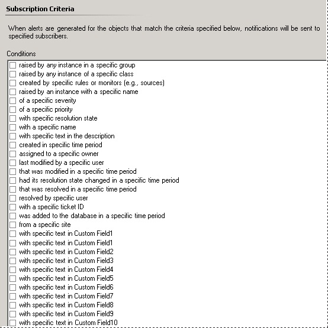

# How to Specify Which Alerts Generate Notifications (Conditions)
When you create a subscription to be notified of Operations Manager alerts, you must specify the criteria or conditions that determine the alerts that will generate a notification. The following illustration shows the conditions you can choose from.  
  
  
  
When you select a condition, it is added to the **Criteria description**. In the **Criteria description** box, the word **specific** is blue and underlined, and is a placeholder for the value for the condition. Click **specific** to set the value for that condition.  
  
For example, for the condition of **a specific severity**, click **specific**, and then select from the available values: **Information**, **Warning**, and **Critical**.  
  
When you create a notification subscription from an alert that has been generated, the conditions for the subscription are configured automatically with values from the specific alert.  
  
## See Also  
[How to Enable an Instant Message Notification Channel](../../om/manage/How-to-Enable-an-Instant-Message-Notification-Channel.md)  
[How to Enable a Text Message &#40;SMS&#41; Notification Channel](../../om/manage/How-to-Enable-a-Text-Message--SMS--Notification-Channel.md)  
[How to Enable a Command Notification Channel](../../om/manage/How-to-Enable-a-Command-Notification-Channel.md)  
[How to Create Notification Subscribers](../../om/manage/How-to-Create-Notification-Subscribers.md)  
[How to Create Notification Subscriptions](../../om/manage/How-to-Create-Notification-Subscriptions.md)  
[Subscribing to Alert Notifications](../../om/manage/Subscribing-to-Alert-Notifications.md)  
[How to Create and Configure the Notification Action Account](../../om/manage/How-to-Create-and-Configure-the-Notification-Action-Account.md)  
[How to Customize Message Content for Notifications](../../om/manage/How-to-Customize-Message-Content-for-Notifications.md)  
[How to Subscribe to Notifications from an Alert](../../om/manage/How-to-Subscribe-to-Notifications-from-an-Alert.md)  
[How to Create Subscriptions Using Classes and Groups](../../om/manage/How-to-Create-Subscriptions-Using-Classes-and-Groups.md)  
[How to Enable an Email Notification Channel](../../om/manage/How-to-Enable-an-Email-Notification-Channel.md)  
[Sending Notifications for Specific Computers and Specific Alerts to Specific Teams](../../om/manage/Sending-Notifications-for-Specific-Computers-and-Specific-Alerts-to-Specific-Teams.md)  
  
