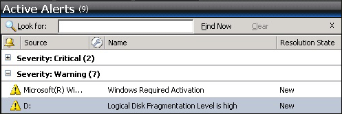
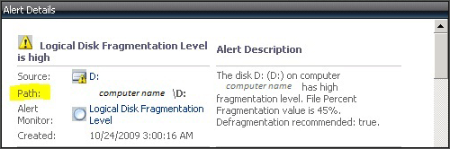
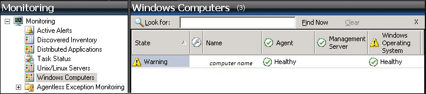
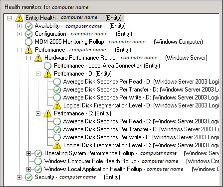

# Identifying the Computer Experiencing a Problem
This topic helps you answer questions such as “I see an alert that says logical disk defragmentation is high. Where is it high?”  
  
### To identify the computer experiencing a problem  
  
1.  Click the alert.  
  
      
  
2.  Look in the **Details** section for the **Path**.  
  
      
  
    Notice that this alert also includes the affected computer in the **Description**.  
  
3.  Click **Windows Computers** to view the state of the computer.  
  
      
  
4.  Right\-click the computer, point to **Open**, and click **Health Explorer**:  
  
      
  
In this illustration, you see that the logical disk fragmentation levels for C: and D: on this computer are in a warning state. Notice that the state rolls up to the **Performance** state for each disk, then to **Hardware Performance** for the computer, then to **Performance** for the computer, and finally to **Entity Health** for the computer.  
  
## See Also  
[How Heartbeats Work in Operations Manager](../../om/manage/How-Heartbeats-Work-in-Operations-Manager.md)  
[Resolving Heartbeat Alerts](../../om/manage/Resolving-Heartbeat-Alerts.md)  
[Viewing Active Alerts](../../om/manage/Viewing-Active-Alerts.md)  
[Viewing Alert Details](../../om/manage/Viewing-Alert-Details.md)  
[Examining Properties of Alerts, Rules, and Monitors](../../om/manage/Examining-Properties-of-Alerts--Rules--and-Monitors.md)  
[Impact of Closing an Alert](../../om/manage/Impact-of-Closing-an-Alert.md)  
[How to Close an Alert Generated by a Monitor](../../om/manage/How-to-Close-an-Alert-Generated-by-a-Monitor.md)  
[How to Reset Health](../../om/manage/How-to-Reset-Health.md)  
[How an Alert is Produced](../../om/manage/How-an-Alert-is-Produced.md)  
[Using Health Explorer to Investigate Problems](../../om/manage/Using-Health-Explorer-to-Investigate-Problems.md)  
[Using Event View to Investigate Problems](../../om/manage/Using-Event-View-to-Investigate-Problems.md)  
[Investigating Alert Storms](../../om/manage/Investigating-Alert-Storms.md)  
[How to View All Rules and Monitors Running on an Agent-Managed Computer](../../om/manage/How-to-View-All-Rules-and-Monitors-Running-on-an-Agent-Managed-Computer.md)  
[How to Set Alert Resolution States](../../om/manage/How-to-Set-Alert-Resolution-States.md)  
[How to Configure Automatic Alert Resolution](../../om/manage/How-to-Configure-Automatic-Alert-Resolution.md)  
[Diagnostic and Recovery Tasks](../../om/manage/Diagnostic-and-Recovery-Tasks.md)  
[Viewing and Investigating Alerts for .NET Applications &#40;Server-side Perspective&#41;](../../om/manage/Viewing-and-Investigating-Alerts-for-.NET-Applications--Server-side-Perspective-.md)  
  
