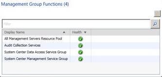
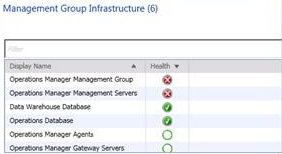
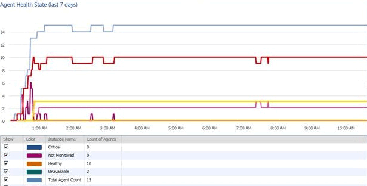
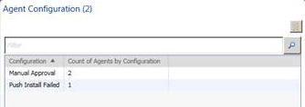
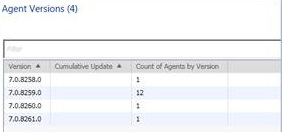

# Monitoring the Health of the Management Group
[!INCLUDE[om12long](../../om/manage/includes/om12long_md.md)] introduces a new dashboard view that provides a comprehensive picture of the health of your management group. The dashboard tries to answer the question, “do I need to do anything?”  
  
The **Management Group Health** view allows you to see at a glance the health state of all management group functions, such as resource pools, and the management group infrastructure, such as management servers. It also shows you recent agent health state including gray agents, agent configuration for agents pending management, and agent versions.  
  
You can display **Management Group Health** on a SharePoint site by using the Operations Manager Web Part, giving all authorized users a useful summary of management group status. For more information, see [Using SharePoint to View Operations Manager Data](../../om/manage/Using-SharePoint-to-View-Operations-Manager-Data.md).  
  
**Management Group Health** automatically refreshes every 15 minutes by default. To manually refresh the view, right\-click the view and click **Refresh**. It may take some time before the dashboard starts to show data. The agent data is recalculated every 15 minutes, and not when you refresh the dashboard.  
  
This topic describes the specific information you will see in each cell of the **Management Group Health** dashboard view.  
  
## Management Group Functions  
  
  
**Management Group Functions** shows you the health state of any of the following functions that are installed in your management group:  
  
-   Agentless exception monitoring  
  
-   Audit collection services  
  
-   System Center Data Access service group  
  
-   System Center Management service group  
  
-   Network discovery  
  
-   Resource pools  
  
-   Web user interfaces \(web console and reporting web site\)  
  
You can open Health Explorer, alert view, diagram view, event view, performance view, and state view for any of the functions listed. To open a different view, right\-click the display name for the function, and click **Health Explorer** or **Navigation**.  
  
## Management Group Infrastructure  
  
  
**Management Group Infrastructure** shows you the health state of any of the following infrastructure features that are installed in your management group:  
  
-   Operational database  
  
-   Data warehouse database  
  
-   Management group  
  
-   Management servers  
  
-   Gateway servers  
  
-   Agents  
  
You can open Health Explorer, alert view, diagram view, event view, performance view, and state view for any of the features listed. To open a different view, right\-click the display name for the feature, and click **Health Explorer** or **Navigation**.  
  
## Agent Health State  
  
  
**Agent Health State** displays a graph of health states for all agents over the past 7 days.  
  
> [!NOTE]  
> The screenshot for **Agent Health State** displays 9 hour’s worth of data. As additional data is collected, the scale will compress to show a maximum of 7 day’s worth of data.  
  
The graph captures all possible agent states, including “unavailable”, or “gray”, agents. It is possible to unselect health states, if you only want to focus on certain health states.  
  
## Agent Configuration  
  
  
In **Agent Configuration**, you can see how the status of agents in the **Pending Management** folder in the **Administration** workspace. Agents can be pending management for the following reasons:  
  
-   Manual agent install  
  
-   Installation in progress  
  
-   Agent update in progress  
  
-   Repair in progress  
  
-   Agent license limit exceeded  
  
-   Failed agent installation  
  
-   Agent requires update  
  
-   Repair failed  
  
## Agent Versions  
  
  
**Agent Versions** lists the number of agents running each agent version number, including cumulative updates.  
  
## See Also  
[Maintenance of Operations Manager](../../om/manage/Maintenance-of-Operations-Manager.md)  
[How to Configure Grooming Settings for the Reporting Data Warehouse Database](../../om/manage/How-to-Configure-Grooming-Settings-for-the-Reporting-Data-Warehouse-Database.md)  
[Inventory of Operations Manager Infrastructure](../../om/manage/Inventory-of-Operations-Manager-Infrastructure.md)  
[Scheduling Maintenance in Operations Manager](../../om/manage/Scheduling-Maintenance-in-Operations-Manager.md)  
[How and When to Clear the Cache](../../om/manage/How-and-When-to-Clear-the-Cache.md)  
[How to Restart a Management Server](../../om/manage/How-to-Restart-a-Management-Server.md)  
[How to Configure Grooming Settings for the Operations Manager Database](../../om/manage/How-to-Configure-Grooming-Settings-for-the-Operations-Manager-Database.md)  
[Recommendations for Daily, Weekly, and Monthly Operations Manager Tasks](../../om/manage/Recommendations-for-Daily--Weekly--and-Monthly-Operations-Manager-Tasks.md)  
  
