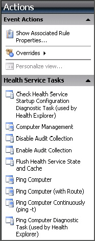
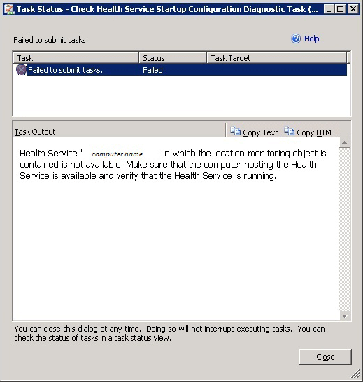

# Running Tasks in Operations Manager
In the [!INCLUDE[om12long](../../om/manage/includes/om12long_md.md)] Operations console, the **Tasks** pane provides links to tasks. A task is a user\-initiated action from the Operations console that is run on an Operations Manager agent. The tasks that are available depend on the management packs that are installed. For example, Operations Manager comes with a core set of functionality that provides the ping task. When you install the SQL Server management pack, it adds SQL\-specific tasks, such as a task to start or stop the SQL Server agent.  
  
> [!NOTE]  
> If the **Tasks** pane is not displayed, click **Tasks** on the toolbar to display it.  
  
Click an alert or object to see tasks for that alert or object. Click a task to run the task.  
  
  
  
In the example above, if you click the first task \(**Check Health Service Startup Configuration Diagnostic Task**\), you see a **Run Task** dialog box:  
  
  
  
Tasks use the default action account, unless you specify other credentials in this dialog box. Tasks can also be configured by a management pack author to use a specific Run As profile.  
  
Generally, you should accept the defaults and click **Run**. You will then see a **Task Status** window:  
  
  
  
In this instance, the task could not be completed successfully. **Task Output** provides you with instructions on troubleshooting the issue.  
  
## See Also  
[General Tasks in Operations Manager_1](../Topic/General%20Tasks%20in%20Operations%20Manager_1.md)  
[Managing Alerts](../../om/manage/Managing-Alerts.md)  
[How to Suspend Monitoring Temporarily by Using Maintenance Mode](../../om/manage/How-to-Suspend-Monitoring-Temporarily-by-Using-Maintenance-Mode.md)  
[Creating and Managing Groups](../../om/manage/Creating-and-Managing-Groups.md)  
[Connecting Management Groups in Operations Manager](../../om/manage/Connecting-Management-Groups-in-Operations-Manager.md)  
[How to Create a Resource Pool](../../om/manage/How-to-Create-a-Resource-Pool.md)  
[Managing Resource Pools for UNIX and Linux Computers](../../om/manage/Managing-Resource-Pools-for-UNIX-and-Linux-Computers.md)  
[Using Operations Manager Shell](../../om/manage/Using-Operations-Manager-Shell.md)  
  
