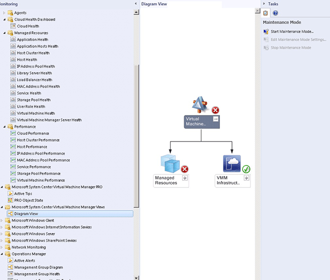

# The Fabric Monitoring Diagram View: Displaying Health States of Cloud Environments
The Fabric Monitoring Diagram view gives you a diagram of the entire infrastructure and shows the health state of each part of the fabric. The Diagram view helps you answer questions, such as “What is the health of my entire fabric?” Improvements to the diagram ensure that health rolls up and that the relevant fabric components are part of the Diagram View.  
  
## Using Diagram View to Locate and Investigate Problems  
  
#### To use Diagram View to locate and investigate problems  
  
1.  To open Diagram View, click **Monitoring**, and in **Microsoft System Center Virtual Machine Manager Views**, click **Diagram View** for the environment you want to see displayed as a diagram.  
  
    Diagram View nodes show the health roll up, so if a node as healthy, you know that everything beneath is also healthy. Similarly, if a node is marked unhealthy, something in that node is having a problem.  
  
      
  
2.  To see where a problem is occurring, click a node that is marked as unhealthy and expand it until you begin to find unhealthy nodes within that tree. When you find the problem you want to investigate right\-click the node and select **Health Explorer**.  
  
3.  In **Health Explorer**, click the monitor you want to investigate and you can see Knowledge and health for each monitor.  
  
4.  To see when and why a monitor became unhealthy, open **State Change Events**.  
  
**More on fabric monitoring**  
  
-   [Monitoring a Private Cloud \- video series](https://curah.microsoft.com/217123/monitoring-a-private-cloud-video-series)  
  
-   [How Healthy is Your Cloud? Fabric Monitoring Can Tell...](http://curah.microsoft.com/42340/how-healthy-is-your-cloud-fabric-monitoring-can-tell)  
  
