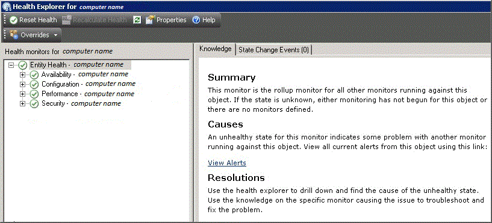

# Using Health Explorer in Operations Manager
In [!INCLUDE[om12long](../../om/manage//om12long_md.md)], you can use the Health Explorer tool to define and diagnose failures on your network. Health Explorer gives you the ability to view and then take action on alerts, state changes, and other significant issues generated by monitoring objects on your network.  
  
You can start Health Explorer from the **Tasks** pane after you select an object, alert, or event in the results pane. Health Explorer organizes health information into the following categories:  
  
-   Performance  
  
-   Security  
  
-   Availability  
  
-   Configuration  
  
All monitors and rules that are defined for a selected object display in the appropriate category.  
  
  
  
The icons used to indicate state are as follows:  
  
|Icon|Meaning|  
|--------|-----------|  
||Unknown, unmonitored \(blank\)|  
||Success, health is OK \(green\)|  
||Warning \(yellow\)|  
||Critical \(red\)|  
||Maintenance mode \(gray\)|  
||Out of contact \(gray\)|  
  
By default, when the Health Explorer windows first opens, all monitors that are in a failed, or red, state are expanded. If a monitor contains other monitors, as in the case of a roll\-up monitor, all monitors are shown in a hierarchical layout so that monitoring data for all dependent services and applications is displayed. If you want to view more detail on any dependent monitor, right\-click that monitor and then click **Monitor Properties** to open another Health Explorer window.  
  
When the Health Explorer window is open, you can review a history of diagnostic tests that have run automatically and the output from those tasks. You can also run additional diagnostic tasks. Any task that is formatted as a hyperlink can run directly from the **Knowledge** tab.  
  
The Health Explorer window refreshes automatically every 30 seconds. Press the F5 function key for an immediate refresh.  
  
For more information on using Health Explorer, see [Using Health Explorer to Investigate Problems](../../om/manage/Using-Health-Explorer-to-Investigate-Problems.md).  
  
## See Also  
[Using the Reporting Workspace in Operations Manager](../../om/manage/Using-the-Reporting-Workspace-in-Operations-Manager.md)  
[Using the Administration Workspace in Operations Manager](../../om/manage/Using-the-Administration-Workspace-in-Operations-Manager.md)  
[Using My Workspace in Operations Manager](../../om/manage/Using-My-Workspace-in-Operations-Manager.md)  
[Using the Authoring Workspace in Operations Manager](../../om/manage/Using-the-Authoring-Workspace-in-Operations-Manager.md)  
[Using the Monitoring Workspace in Operations Manager](../../om/manage/Using-the-Monitoring-Workspace-in-Operations-Manager.md)  
[How to Connect to the Web Console](../../om/manage/How-to-Connect-to-the-Web-Console.md)  
[How to Connect to the Operations Console](../../om/manage/How-to-Connect-to-the-Operations-Console.md)  
[Using the Operations Manager Consoles](../../om/manage/Using-the-Operations-Manager-Consoles.md)  
  
