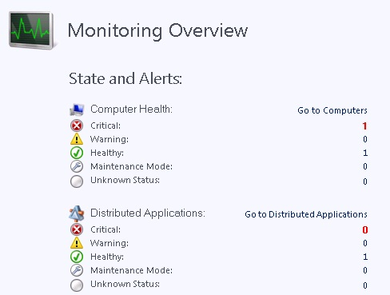

# Using the Monitoring Workspace in Operations Manager
In [!INCLUDE[om12long](../../om/manage//om12long_md.md)], the Monitoring workspace is the primary workspace for operators. The Monitoring workspace is basically the same in both the Operations and Web consoles.  
  
When you open the Monitoring workspace, you see an overview that summarizes the health of distributed applications and computers, as well as the objects that are in maintenance mode, as shown in the following image.  
  
  
  
In the **State and Alerts** overview, click any of the numbers to see a detailed view. For example, if you click the number shown for **Maintenance Mode**, a state view of all computers in maintenance mode opens.  
  
The health states that are summarized in the overview only tell you part of what is going on in your environment. You will also want to review the alerts that have been generated. In the navigation pane, click **Active Alerts** to see all alerts. For more information about dealing with alerts, see [Managing Alerts](../../om/manage/Managing-Alerts.md).  
  
There are number of views in the **Monitoring** workspace that allow you to view the status of your environment. For information on each view, see [Standard Views in Operations Manager](../../om/manage/Standard-Views-in-Operations-Manager.md). You can change the display options of a view and save it as a personalized view. For more information, see [How to Personalize a View in Operations Manager](../../om/manage/How-to-Personalize-a-View-in-Operations-Manager.md).  
  
As you work with Operations Manager, you may discover that there are specific views that you frequently access. You can create a customized workspace that displays your favorite views and searches. For more information, see [Using My Workspace in Operations Manager](../../om/manage/Using-My-Workspace-in-Operations-Manager.md).  
  
## See Also  
[Using My Workspace in Operations Manager](../../om/manage/Using-My-Workspace-in-Operations-Manager.md)  
[Comparing the Operations Console and Web Console in Operations Manager](../../om/manage/Comparing-the-Operations-Console-and-Web-Console-in-Operations-Manager.md)  
[Standard Views in Operations Manager](../../om/manage/Standard-Views-in-Operations-Manager.md)  
[How to Personalize a View in Operations Manager](../../om/manage/How-to-Personalize-a-View-in-Operations-Manager.md)  
[Finding Data and Objects in the Operations Manager Consoles](../../om/manage/Finding-Data-and-Objects-in-the-Operations-Manager-Consoles.md)  
[Using the Reporting Workspace in Operations Manager](../../om/manage/Using-the-Reporting-Workspace-in-Operations-Manager.md)  
[Using the Administration Workspace in Operations Manager](../../om/manage/Using-the-Administration-Workspace-in-Operations-Manager.md)  
[Using My Workspace in Operations Manager](../../om/manage/Using-My-Workspace-in-Operations-Manager.md)  
[Using Health Explorer in Operations Manager](../../om/manage/Using-Health-Explorer-in-Operations-Manager.md)  
[Using the Authoring Workspace in Operations Manager](../../om/manage/Using-the-Authoring-Workspace-in-Operations-Manager.md)  
[How to Connect to the Web Console](../../om/manage/How-to-Connect-to-the-Web-Console.md)  
[How to Connect to the Operations Console](../../om/manage/How-to-Connect-to-the-Operations-Console.md)  
[Using the Operations Manager Consoles](../../om/manage/Using-the-Operations-Manager-Consoles.md)  
  
