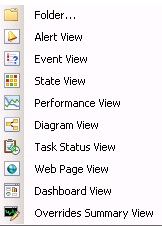
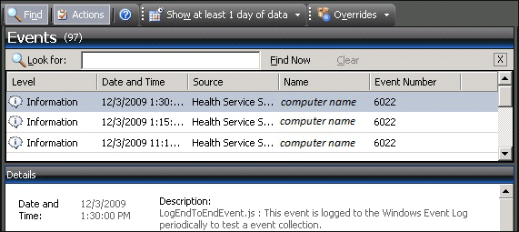
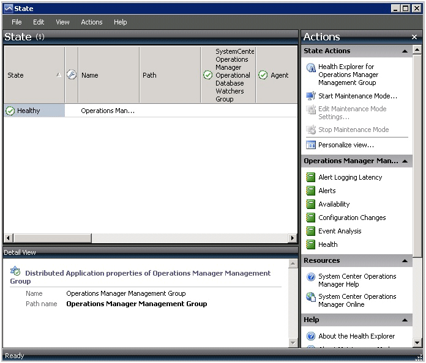
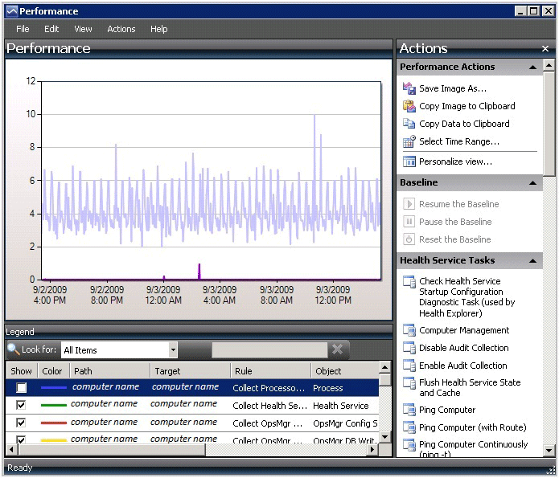
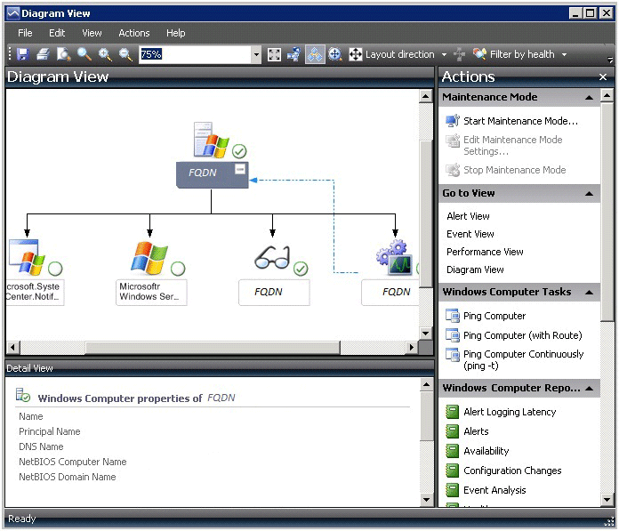
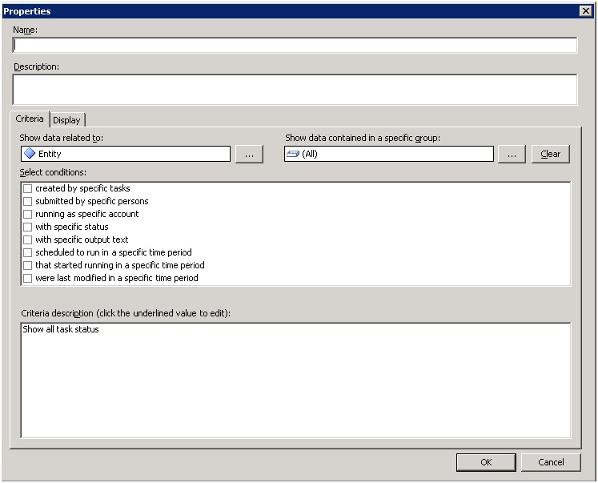
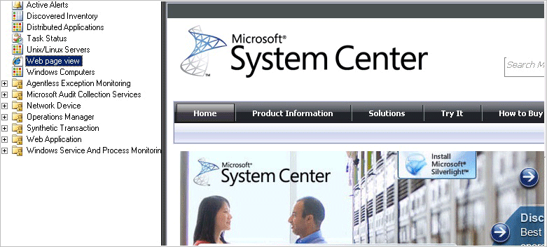
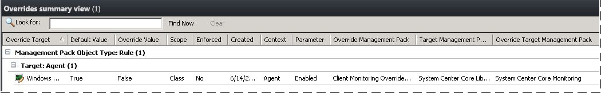
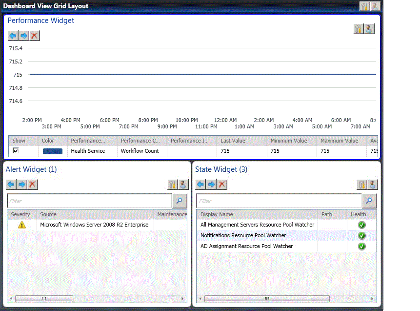

# View Types in Operations Manager
Each view type in [!INCLUDE[om12long](../../om/manage/includes/om12long_md.md)] displays a different aspect of monitoring data. Each view type has a different icon as shown in the following image.  
  
  
  
For more information on specific view types, see:  
  
-   [Alert View Type](../../om/manage/View-Types-in-Operations-Manager.md#bkmk_alertviewtype)  
  
-   [Event View Type](../../om/manage/View-Types-in-Operations-Manager.md#bkmk_eventviewtype)  
  
-   [State View Type](../../om/manage/View-Types-in-Operations-Manager.md#bkmk_stateviewtype)  
  
-   [Performance View Type](../../om/manage/View-Types-in-Operations-Manager.md#bkmk_performanceviewtype)  
  
-   [Diagram View Type](../../om/manage/View-Types-in-Operations-Manager.md#bkmk_diagramviewtype)  
  
-   [Task Status View Type](../../om/manage/View-Types-in-Operations-Manager.md#bkmk_taskstatusviewtype)  
  
-   [Web Page View Type](../../om/manage/View-Types-in-Operations-Manager.md#bkmk_webpageviewtype)  
  
-   [Overrides Summary View Type](../../om/manage/View-Types-in-Operations-Manager.md#bkmk_overridessummaryviewtype)  
  
-   [Dashboard View Type](../../om/manage/View-Types-in-Operations-Manager.md#bkmk_dashboardviewtype)  
  
## Alert View Type  
The alert view displays alerts that meet your specific criteria, such as alert severity, resolution state, or alerts that are assigned to you. For information on creating an alert view, see [How to Create an Alert View](../../om/manage/Creating-Views-in-Operations-Manager.md#bkmk_howtocreateanalertview).  
  
  
  
## Event View Type  
The event view queries the event logs and displays events that are based on criteria specified in the event view properties. For information on creating an event view, see [How to Create an Event View](../../om/manage/Creating-Views-in-Operations-Manager.md#bkmk_howtocreateaneventview).  
  
  
  
## State View Type  
The state view displays relationships between components, computers, and computer groups. For information on creating a state view, see [How to Create a State View](../../om/manage/Creating-Views-in-Operations-Manager.md#bkmk_howtocreateastateview).  
  
  
  
## Performance View Type  
The performance view allows you to customize how you want to view performance data collected from performance objects and counters. This includes the ability to view historical and current operational data together. You must select **Show** in the Details pane to display data from a rule in the graph in the Results pane. For information on creating a performance view, see [How to Create a Performance View](../../om/manage/Creating-Views-in-Operations-Manager.md#bkmk_howtocreateaperformanceview).  
  
  
  
## Diagram View Type  
The Diagram view displays a graphical view of a set of managed objects and how they relate to one another. For information on creating a diagram view, see [How to Create a Diagram View](../../om/manage/Creating-Views-in-Operations-Manager.md#bkmk_howtocreateadiagramview).  
  
  
  
## Task Status View Type  
The task status view displays tasks that meet criteria specified in the properties, such as only those tasks that apply to certain object types. For information on creating a task status view, see [How to Create a Task Status View](../../om/manage/Creating-Views-in-Operations-Manager.md#bkmk_howtocreateataskstatusview).  
  
  
  
> [!NOTE]  
> Users that are members of the Read\-only Operator role cannot view or run any tasks. For this reason, no tasks appear in a task status view that is opened by a Read\-only Operator.  
  
## Web Page View Type  
The Web page view displays a Web page in a separate window in the Operations console. For information on creating a Web page view, see [How to Create a Web Page View](../../om/manage/Creating-Views-in-Operations-Manager.md#bkmk_howtocreateawebpageview).  
  
  
  
## Overrides Summary View Type  
You can only create an overrides summary view in My Workspace.  
  
You can view all rule and monitor overrides in the overrides summary view. The overrides summary view can be used for both sealed and unsealed management packs. You can customize this view by grouping items by multiple column headers. For information on creating an overrides summary view, see [How to Create an Overrides Summary View](../../om/manage/Creating-Views-in-Operations-Manager.md#bkmk_howtocreateanoverridessummaryview).  
  
  
  
## Dashboard View Type  
The dashboard view allows you to present multiple types of data in a single view.  
  
> [!IMPORTANT]  
> When a dashboard view uses data from the data warehouse database, operators might be able to view data that they would not otherwise have access to in views that use data from the operational database.  
  
  
  
For information on creating a dashboard view, see [How to Create a Dashboard View](../../om/manage/Creating-Views-in-Operations-Manager.md#bkmk_howtocreateadashboardview).  
  
## See Also  
[Using Views in Operations Manager](../../om/manage/Using-Views-in-Operations-Manager.md)  
[Creating Views in Operations Manager](../../om/manage/Creating-Views-in-Operations-Manager.md)  
[How to Personalize a View in Operations Manager](../../om/manage/How-to-Personalize-a-View-in-Operations-Manager.md)  
[Guidance for Scoping and Targeting Views](../../om/manage/Guidance-for-Scoping-and-Targeting-Views.md)  
  
