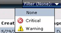
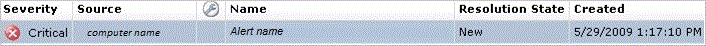

# Viewing Active Alerts
To view active alerts, open the Operations console and click **Monitoring**. The Monitoring Overview displays a summary of health states and alerts:  
  
  
  
To view the actual alerts, click **Active Alerts** in the navigation pane.  
  
**Tip**: If you are using the web console, you can filter the view of alerts by severity:  
  
  
  
The list of alerts in the Results pane includes the severity, source, maintenance mode status, name, resolution state, and when the alert was created:  
  
  
  
The following folders in the Monitoring workspace include a standard Active Alerts view scoped to the objects for that folder.  
  
-   Data Warehouse  
  
-   Network Monitoring  
  
-   Operations Manager  
  
-   Operations Manager\\Agent Details  
  
-   Operations Manager\\APM Agent Details  
  
-   Management Server  
  
-   Notification  
  
-   UNIX\/Linux Servers  
  
-   Web Application Availability Monitoring  
  
## See Also  
[How Heartbeats Work in Operations Manager](../../om/manage/How-Heartbeats-Work-in-Operations-Manager.md)  
[Resolving Heartbeat Alerts](../../om/manage/Resolving-Heartbeat-Alerts.md)  
[How an Alert is Produced](../../om/manage/How-an-Alert-is-Produced.md)  
[Viewing Alert Details](../../om/manage/Viewing-Alert-Details.md)  
[Examining Properties of Alerts, Rules, and Monitors](../../om/manage/Examining-Properties-of-Alerts--Rules--and-Monitors.md)  
[Impact of Closing an Alert](../../om/manage/Impact-of-Closing-an-Alert.md)  
[How to Close an Alert Generated by a Monitor](../../om/manage/How-to-Close-an-Alert-Generated-by-a-Monitor.md)  
[How to Reset Health](../../om/manage/How-to-Reset-Health.md)  
[Identifying the Computer Experiencing a Problem](../../om/manage/Identifying-the-Computer-Experiencing-a-Problem.md)  
[Using Health Explorer to Investigate Problems](../../om/manage/Using-Health-Explorer-to-Investigate-Problems.md)  
[Using Event View to Investigate Problems](../../om/manage/Using-Event-View-to-Investigate-Problems.md)  
[Investigating Alert Storms](../../om/manage/Investigating-Alert-Storms.md)  
[How to View All Rules and Monitors Running on an Agent-Managed Computer](../../om/manage/How-to-View-All-Rules-and-Monitors-Running-on-an-Agent-Managed-Computer.md)  
[How to Set Alert Resolution States](../../om/manage/How-to-Set-Alert-Resolution-States.md)  
[How to Configure Automatic Alert Resolution](../../om/manage/How-to-Configure-Automatic-Alert-Resolution.md)  
[Diagnostic and Recovery Tasks](../../om/manage/Diagnostic-and-Recovery-Tasks.md)  
[Viewing and Investigating Alerts for .NET Applications &#40;Server-side Perspective&#41;](../../om/manage/Viewing-and-Investigating-Alerts-for-.NET-Applications--Server-side-Perspective-.md)  
[Standard Views in Operations Manager](../../om/manage/Standard-Views-in-Operations-Manager.md)  
  
