# Viewing and Investigating Alerts for .NET Applications (Server-side Perspective)
After you have configured .NET applications to be monitored, you can view alerts and begin investigating the issues.  
  
### To view and investigate alerts for .NET applications \(server\-side example\)  
  
1.  To view active alerts by application group, in the [!INCLUDE[om12long](../../om/manage/includes/om12long_md.md)] console, in the navigation pane, click the **Monitoring** button, expand **Application Monitoring**, expand **.NET Monitoring**, expand the folder with the name of the application group you configured for monitoring, and then click **Active Alerts**.  
  
    **View alerts by application group**  
  
    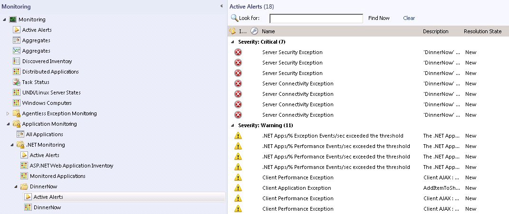  
  
    Additional views:  
  
    -   To see why a monitoring aspect is unhealthy, use the application group state view and click the state view cell related to it. The Details View will show you the instance and the state of the Availability, Configuration, Performance, and Security monitors. You can also start the Health Explorer in context of the application instance to see which monitors have gone into a critical or warning state.  
  
        **Application group state view**  
  
        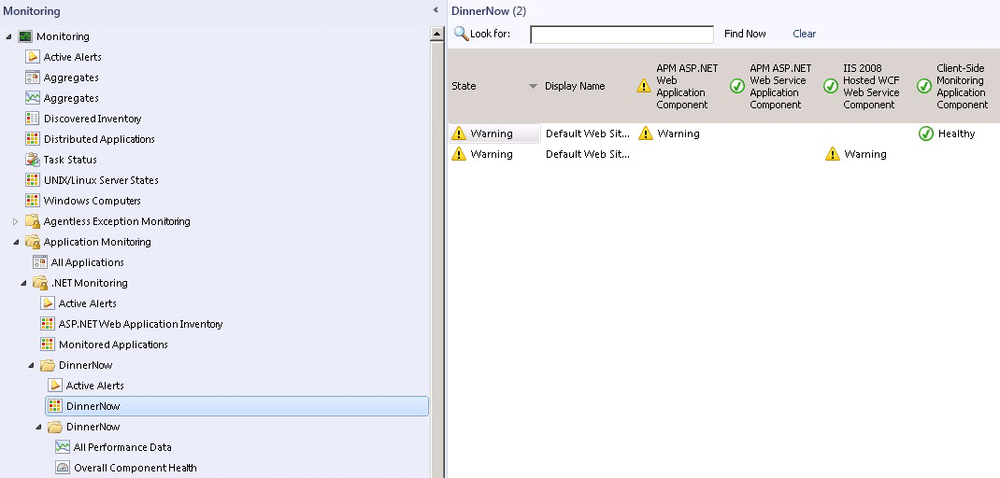  
  
    -   To see application performance, in the application component folder, click **All Performance Data**. This gives you the base information about each component, shown by instance.  
  
        **All performance data**  
  
        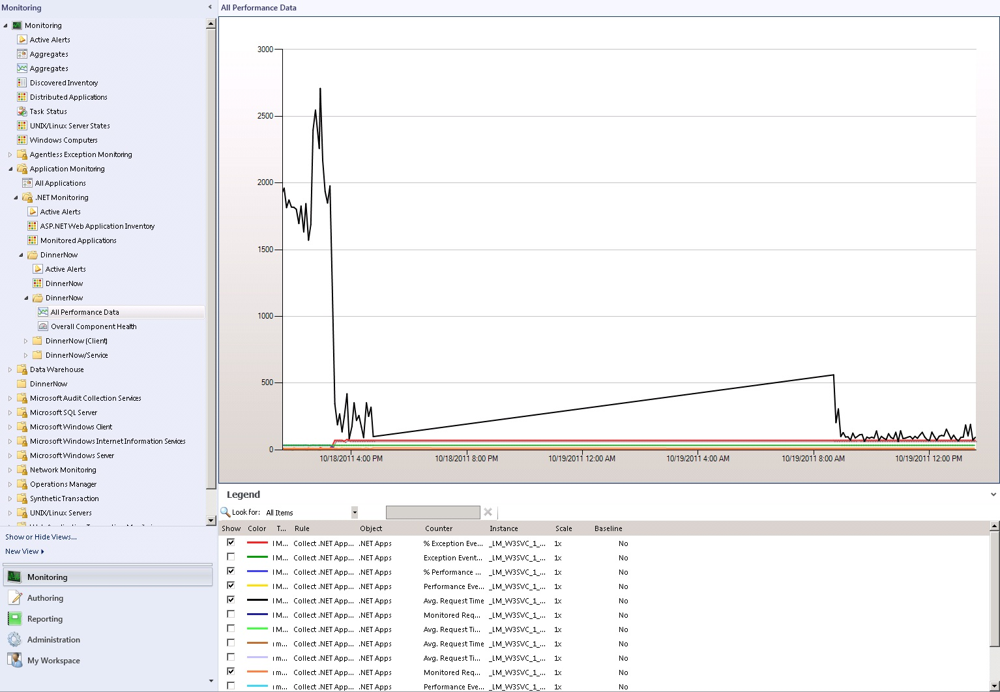  
  
    -   To see the overall health dashboard view of the components you selected for the application you are monitoring, in the application component folder, click **Overall Component Health**. You will see the application state, active alerts, and a detail view.  
  
        **Overall component health**  
  
        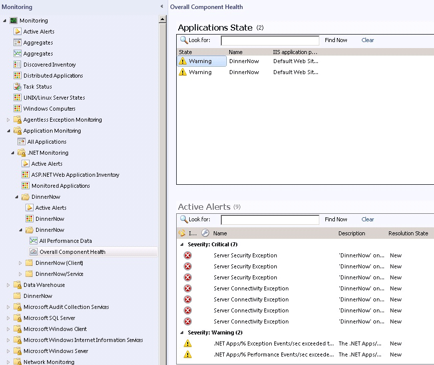  
  
    To work with data collected by client\-side monitoring, in the [!INCLUDE[om12short](../../om/manage/includes/om12short_md.md)] console, in the navigation pane, click the **Monitoring** button, expand **Application Monitoring**, expand **.NET Monitoring**, and then application name \(client\) folder. The client\-side monitoring process is very similar to server\-side monitoring, except that you click **All Performance Data** and **Overall Component Health** in the application name \(client\) folder to view alerts pertaining to the client\-side monitoring for the application group.  
  
    To make sure client\-side application monitoring is working, go to the application group state view and the **CSM Application Component** will have application monitoring status filled in.  
  
    > [!NOTE]  
    > Client\-side monitoring is an extension of server\-side monitoring that is not enabled by default. You set it up through the same template as server\-side monitoring. It might take a few minutes to discover the objects after you set up client\-side monitoring.  
  
2.  To see general details about an alert, click an alert. The **Alert Details** pane describes the alert, including information about its source, rule, creation date, and the monitoring setting that caused the alert to be raised.  
  
3.  To begin investigating an alert and view the alert description, double\-click an alert. The **Alert Properties** page will open.  
  
    **Begin investigating alerts on the Alert Properties page**  
  
    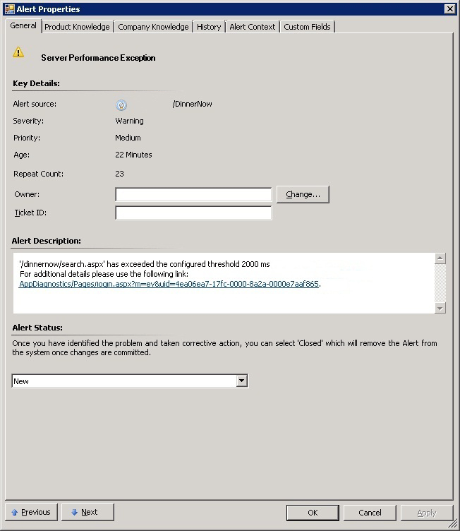  
  
    > [!NOTE]  
    > To see details about an alert in any of these views, click the alert you want to investigate and look in the **Alert Details** pane for the **Knowledge** section. You can also open the Alert Properties page, which shows the details of an alert and you can enter alert status. To open the Alert Properties page, double\-click an alert or in the **Tasks** pane, in the **Tasks** section, click **Alert Properties**.  
  
4.  On the **Alert Properties** page, click the link in the **Alert Description** pane. This opens Application Diagnostics, a new monitoring feature in [!INCLUDE[om12short](../../om/manage/includes/om12short_md.md)] in a web browser. Here on the **Event properties** tab you can see information, such as the performance metrics, the call stack, and collection notes. For more information on the Event properties tab, see Performance Event Details. Click **Yes** to close the main window once the event information has loaded.  
  
    > [!NOTE]  
    > This link to Application Diagnostics is also on the **Alert Context** tab.  
  
5.  **Application Diagnostics Event properties**  
  
    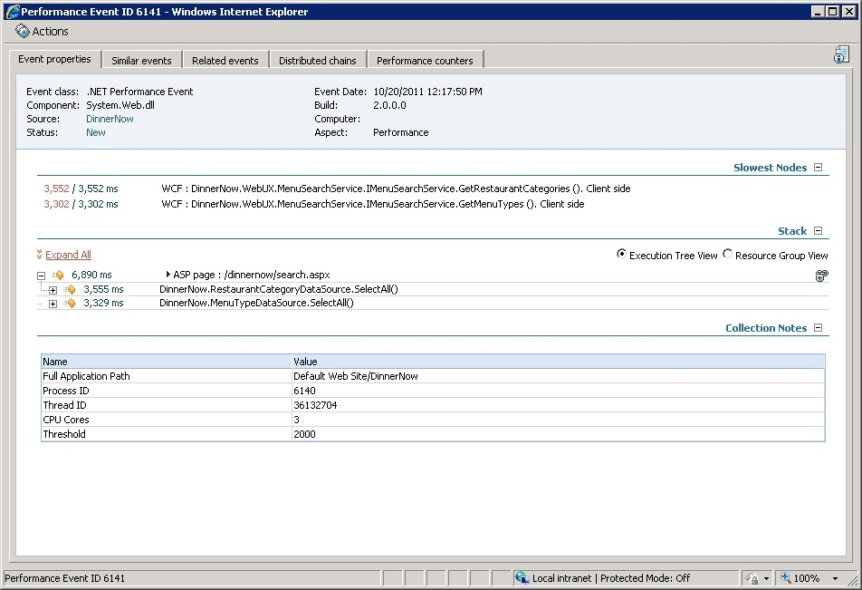  
  
6.  On the **Event Properties** tab, expand the **Stack** section. The stack is the order in which events happened. The **Resource Group View** and **Execution Tree View** allow you to expand nodes to investigate the various calls. This view helps answer which tier the problem is in, or where is it occurring.  
  
    **Application Diagnostics tree views lets you see exactly what went wrong where and when.**  
  
    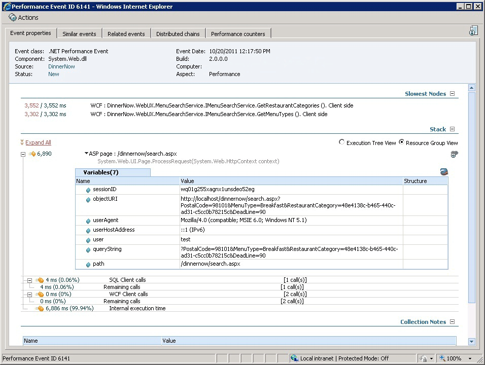  
  
7.  To see how this event relates to other events in the chain of events, on the Application Diagnostics page, click the **Distributed chains** tab. This view shows all of the components that are involved in the request.  
  
    **Application Diagnostics Distributed chains show how events relate to each other.**  
  
    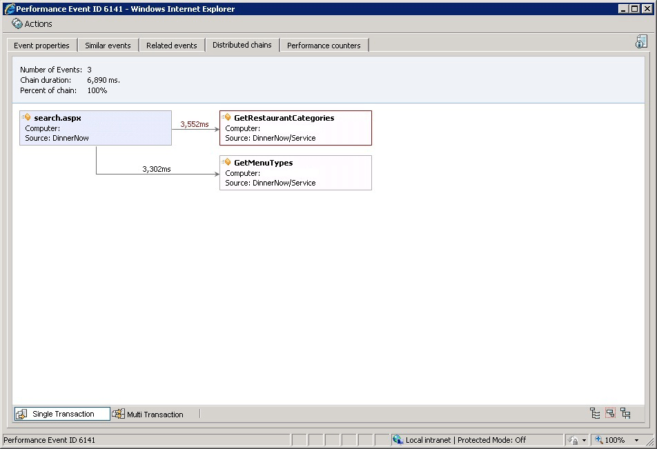  
  
8.  To pinpoint the root cause of the problem or incident, click the last event in the chain. This is the latest event that broke the performance threshold. The **Event Properties** tab for that event will open.  
  
9. On the **Application Diagnostics** page, click the **Performance counters** tab. Performance counters show the system 15 minutes before the event happened. This gives a baseline measure before the event, which allows you to see your system state before the event so that you know if the system was impacting the performance of the application.  
  
    **Application Diagnostics Performance counters allow you to compare system performance before, during, and after an event.**  
  
    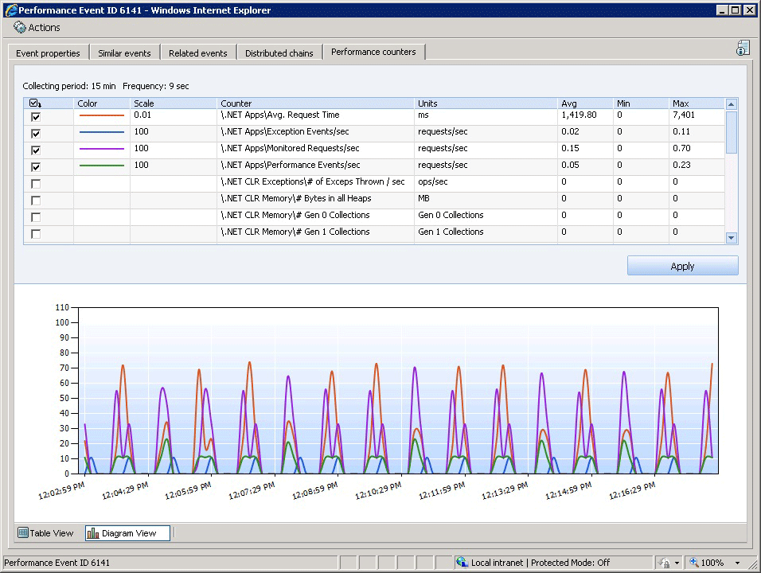  
  
10. On the **Application Diagnostics** page, click the **Similar events** tab. Similar events are the other events that are in the same problem group. On this page you can filter similar events by **Problem** and **Heaviest Resource** to help you identify trends.  
  
    **Application Diagnostics Similar events allow you to compare similar events to identify trends.**  
  
    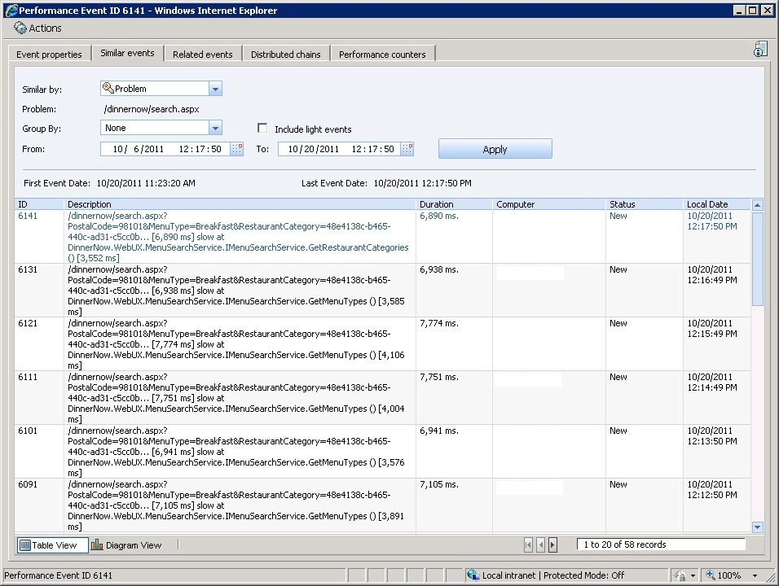  
  
11. On the **Application Diagnostics** page, click the **Related events** tab. Related events are events that occurred around the same time as the event you are investigating. Related events tell you what else is going on about the same time as the event you are investigating. You can increase or decrease the range of time in which other related events occurred relative to the event you are investigating. In general, specifying a greater time range shows you more related events.  
  
    **Application Diagnostics Related events allows you to see what other events are occurring about the same time as the event you are investigating.**  
  
    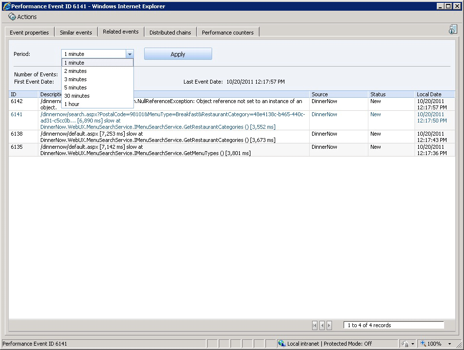  
  
