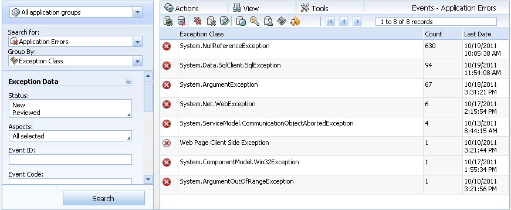
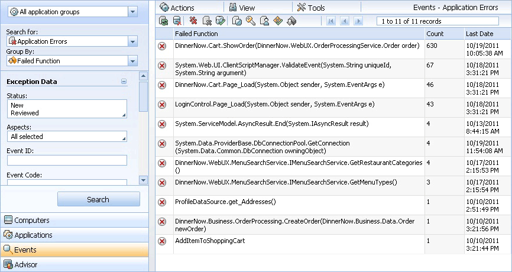
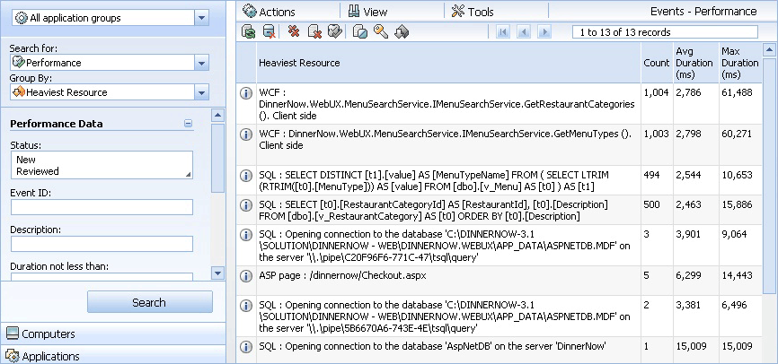

# Working with the Application Diagnostics Console
The Application Diagnostics console is an event management system for .NET Application Performance Monitoring in [!INCLUDE[om12long](../../om/manage/includes/om12long_md.md)]. You can use Application Diagnostics console to monitor deployed .NET applications for slowdowns, faults, and failures, and immediately pinpoint the source of the problem.  
  
## The Application Diagnostics Console  
The Application Diagnostics console is the place to look at the individual performance and reliability events that are being raised within your environment. You can look at all of the events, or group them into “problem groups” in which events coming from the same sources are grouped together to highlight the problems with the monitored applications. Use Application Diagnostics to look at events and the transaction chains related to those events to understand how the performance and reliability issues are impacting your applications. The Application Advisor console provides analytics and telemetry of the data presented in Application Diagnostics. Through the Application Advisor console you gain insights into which events are causing the most problems. For more information about Application Advisor, see [Prioritizing Alerts by Using Application Advisor](../../om/manage/Prioritizing-Alerts-by-Using-Application-Advisor.md)  
  
#### To open the Application Diagnostics console  
  
1.  Application Diagnostics and Application Advisor are installed along with the Operations Manager web console. To find the web address of the Operations Manager web console, open the Operations console. In the navigation pane, click the **Administration** button, click **Settings**, and then double\-click **Web Addresses**. The Operations Manager web console URL will be specified as: http\(s\):\/\/<web host>\/OperationsManager. Using this URL format and the same web host, here are the links to Application Advisor and Application Diagnostics:  
  
    -   The Application Diagnostics console address is: http\(s\):\/\/<web host>\/AppDiagnostics  
  
    -   The Application Advisor console address is: http\(s\):\/\/<web host>\/AppAdvisor  
  
    To make access to the consoles easy, add all three console URLs to your web browser’s favorites list.  
  
    To open Application Diagnostics, paste the Application Diagnostics URL into your browser. Application Diagnostics opens in the web browser window.  
  
    > [!NOTE]  
    > If you are running [!INCLUDE[om12short](../../om/manage/includes/om12short_md.md)] on a server rather than a client computer, you can access Application Diagnostics and Application Advisor from the **Start** menu in **All Programs**.  
  
    Access to Application Diagnostics is controlled through the Application Monitoring Operator and Administrator roles. You must be a member of one of these roles to have rights to the console. For more information, see [User Roles for Application Performance Monitoring](../../om/manage/User-Roles-for-Application-Performance-Monitoring.md)  
  
## Viewing Events by Areas of Interest  
In Application Diagnostics, there are two major types of events, those related to application performance and those related to application failures and errors. The failures and errors can be divided further into connectivity, security, and failure issues. Failure issues are typically related to a problem with the application code. In Application Diagnostics, you can view events grouped in these ways:  
  
-   All \(displays all events\)  
  
-   Application Errors \(displays exception events\)  
  
-   Performance \(displays performance events\)  
  
#### To select the type of events to view  
  
1.  Open Application Diagnostics and select **Events** from the Navigation pane.  
  
2.  In the Navigation pane, use the **Search for** menu to select the category of events you want to view.  
  
## Grouping Events within Areas of Interest  
Grouping application events by similarity provides the best method for determining if the same issue has occurred before and ensuring that resources responsible for the issue resolution are allocated in the most efficient way.  
  
#### To group events into areas of interest  
  
1.  Open Application Diagnostics and select **Events** from the Navigation pane.  
  
2.  In the Navigation pane, use the **Search for** menu to select the category of events you want to view.  
  
3.  In the **Group By** menu, select the way you want to group the events.  
  
Your first selection \(**Application Errors** and **Performance**\) affects the grouping options you see for your second selection.  
  
### Grouping Application Errors  
  
-   **Problem** What it displays: All events in this grouping are coming from the same entry point into the application \(for example, a method or a web page\) and have the same call stack. Value: Consolidating events by problem allows you to prioritize your efforts to correct an issue based on the number of events in the group.  
  
-   **Action** What it displays: Action\-based consolidation categorizes events based on entry points, such as page calls, button clicks, web service calls, or some other action representing a particular process. Value: This grouping is valuable for determine under what circumstances a failure occurs.  
  
-   **Exception Class** What it displays: The bottom level exception thrown by each event is the same. Value: Consolidating by exception class is a good way to find the most typical coding mistakes and promotes improved coding practices.  
  
-   **Failed Function** What it displays: The exception occurred in the same function for each event. Value: This grouping is valuable for two reasons: First, it allows you to identify cases where a shared function is used incorrectly. Second, it allows you to identify how many applications are impacted by an error in a shared function.  
  
-   **None** This option does not group the events.  
  
### Grouping Performance Events  
  
-   **Problem** What it displays: All events in this grouping have the identical call stack. Value: Consolidating events by problem allows you to prioritize your efforts to correct an issue based on the number of events in the group.  
  
-   **Heaviest Resource** What it displays: All events triggered by the same resource call. This grouping is valuable for determine which events exceeded their thresholds more than other resources.  
  
-   **None** This option does not group the events.  
  
## Example: Grouping Application Errors by Exception Class  
Filtering by application errors and exception class quickly shows you which kinds, or classes, of exception events you are receiving most often.  
  
  
  
#### To group application errors by exception class  
  
1.  Open Application Diagnostics and select **Events** from the Navigation pane.  
  
2.  In the Navigation pane, in the **Search for** menu, select **Application Errors**.  
  
3.  In the **Group By** menu, select **Exception Class**.  
  
4.  To sort by count, at the top of the Count column, click **Count**. The exception classes that have occurred most often are ranked from highest to lowest.  
  
5.  To begin investigating the issue and open Event properties, click an **Exception Class** entry. For information about working with events, see [Working with Events by Using Application Diagnostics](../../om/manage/Working-with-Events-by-Using-Application-Diagnostics.md)  
  
## Example: Grouping Application Errors by Failed Function  
Filtering by application errors and failed function quickly shows you which functions are failing most often. The functions that are failing the most are the ones you should investigate first to have the highest impact on your application’s reliability.  
  
  
  
#### To group application errors by failed function  
  
1.  In the navigation pane, in the **Search for** menu, select **Application Errors**.  
  
2.  In the **Group By** menu, select **Failed Function**.  
  
3.  To sort by count, at the top of the Count column, click **Count**. The functions that have failed most often are ranked from highest to lowest.  
  
4.  To begin investigating the issue and open Event properties, click a **Failed Function** entry. For information about working with events, see [Working with Events by Using Application Diagnostics](../../om/manage/Working-with-Events-by-Using-Application-Diagnostics.md)  
  
## Example: Grouping Performance Events by Heaviest Resource  
Filtering by application errors and exception class quickly shows you which performance events are triggered by the same resource call. The performance events that are most often triggered by the same resource call are the ones you should investigate first to have the highest impact on you application’s performance.  
  
  
  
#### To group performance events by heaviest resource  
  
1.  In the navigation pane on the left, in the **Search for** menu, select **Performance**.  
  
2.  In the **Group By** menu, select **Heaviest Resource**.  
  
3.  To sort by count, at the top of the Count column, click **Count**. The exception classes that have occurred most often are ranked from highest to lowest. You can also sort by average duration and maximum duration to see if some events that are occurring less often are still causing long delays and therefore should receive your attention.  
  
4.  To begin investigating the issue and open Event properties, click a **Heaviest Resource** entry. For information about working with events, see [Working with Events by Using Application Diagnostics](../../om/manage/Working-with-Events-by-Using-Application-Diagnostics.md)  
  
## See Also  
[Prioritizing Alerts by Using Application Advisor](../../om/manage/Prioritizing-Alerts-by-Using-Application-Advisor.md)  
[Viewing and Investigating Alerts for .NET Applications &#40;Server-side Perspective&#41;](../../om/manage/Viewing-and-Investigating-Alerts-for-.NET-Applications--Server-side-Perspective-.md)  
  
