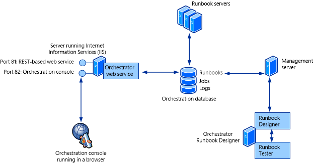
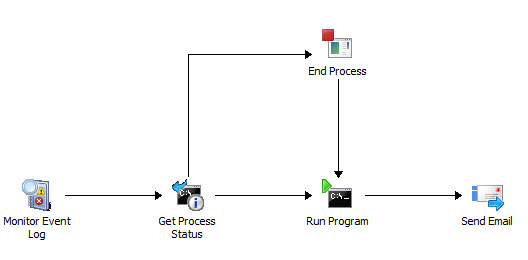

# Orchestrator Architecture
This topic provides an overview of [!INCLUDE[orchlong](../../orch/deploy/includes/orchlong_md.md)], including a description of the system architecture, the internals of a typical runbook workflow, and the flow of a deployed runbook.  
  
## Orchestrator deployment basics  
The following table lists the features in a basic deployment of [!INCLUDE[orchshort](../../om/manage/includes/orchshort_md.md)].  
  
|Orchestrator feature|Description|  
|------------------------|---------------|  
|management server|The management server is the communication layer between the Runbook Designer and the orchestration database.|  
|runbook server|A runbook server is where an instance of a runbook runs. Runbook servers communicate directly with the orchestration database. You can deploy multiple runbook servers per [!INCLUDE[orchshort](../../om/manage/includes/orchshort_md.md)] installation to increase capacity and redundancy.|  
|orchestration database|The database is a Microsoft SQL Server database that contains all of the deployed runbooks, the status of running runbooks, log files, and configuration data for [!INCLUDE[orchshort](../../om/manage/includes/orchshort_md.md)].|  
|Runbook Designer|The Runbook Designer is the tool used to build, edit, and manage [!INCLUDE[orchshort](../../om/manage/includes/orchshort_md.md)] runbooks. For more information about the Runbook Designer, see [Using Runbooks in System Center 2012 - Orchestrator](../../orch/manage/Using-Runbooks-in-System-Center-2012---Orchestrator.md).|  
|Runbook Tester|Runbook Tester is a run\-time tool used to test runbooks developed in the Runbook Designer. For more information about Runbook Tester, see [How to Test a Runbook](assetId:///057bbb5a-f836-4ae0-b288-093e409c3665) in [Using Runbooks in System Center 2012 - Orchestrator](../../orch/manage/Using-Runbooks-in-System-Center-2012---Orchestrator.md).|  
|Orchestration console|The Orchestration console lets you start or stop runbooks and view real\-time status on a web browser. For more information about using the Orchestration console, see [Using the Orchestration Console in System Center 2012 - Orchestrator](../../orch/manage/Using-the-Orchestration-Console-in-System-Center-2012---Orchestrator.md).|  
|[!INCLUDE[orchshort](../../om/manage/includes/orchshort_md.md)] web service|The [!INCLUDE[orchshort](../../om/manage/includes/orchshort_md.md)] web service is a Representational State Transfer \(REST\)\-based service that enables custom applications to connect to [!INCLUDE[orchshort](../../om/manage/includes/orchshort_md.md)] to start and stop runbooks, and retrieve information about operations by using custom applications or scripts. The Orchestration console uses this web service to interact with [!INCLUDE[orchshort](../../om/manage/includes/orchshort_md.md)].|  
|Deployment Manager|Deployment Manager is a tool used to deploy integration packs \(IPs\), runbook servers, and Runbook Designers. For more information about this tool, see [Deploying System Center 2012 - Orchestrator](../../orch/deploy/Deploying-System-Center-2012---Orchestrator.md).|  
  
## Architectural diagram  
The following diagram illustrates each of the [!INCLUDE[orchshort](../../om/manage/includes/orchshort_md.md)] features and the communication between each.  
  
  
  
The orchestration database is the center of the [!INCLUDE[orchshort](../../om/manage/includes/orchshort_md.md)] installation containing all runbooks, configuration settings, and logs. The management server is required as a communication layer between the Runbook Designer and the orchestration database. One or more runbook servers communicate directly with the database to retrieve runbooks to run and store information about the jobs created from the runbooks. The web service also communicates directly with the orchestration database and provides a web browser connection for the Orchestration console.  
  
## [!INCLUDE[orchshort](../../om/manage/includes/orchshort_md.md)] Extensions  
The following table shows multiple strategies available for extending the functionality provided by a standard installation of [!INCLUDE[orchshort](../../om/manage/includes/orchshort_md.md)]. For additional information, see [Deploying System Center 2012 - Orchestrator](../../orch/deploy/Deploying-System-Center-2012---Orchestrator.md).  
  
|[!INCLUDE[orchshort](../../om/manage/includes/orchshort_md.md)] feature|Description|  
|-----------------------------------------------------------|---------------|  
|integration pack \(IP\)|An integration pack is a collection of custom activities specific to a product or technology. Microsoft and other companies provide integration packs with activities to interact with their product from an [!INCLUDE[orchshort](../../om/manage/includes/orchshort_md.md)] runbook.|  
|[!INCLUDE[orchshort](../../om/manage/includes/orchshort_md.md)] Integration Toolkit|The [!INCLUDE[orchshort](../../om/manage/includes/orchshort_md.md)] Integration Toolkit lets you extend your library of activities beyond the collection of standard activities and integration packs. The Integration Toolkit has wizard\-based tools to create new activities and integration packs for [!INCLUDE[orchshort](../../om/manage/includes/orchshort_md.md)]. Developers can also use the Integration Toolkit to create integration packs from custom activities that they build by using the [!INCLUDE[orchshort](../../om/manage/includes/orchshort_md.md)] SDK.|  
  
## Automation by using runbooks  
To automate a task or process in [!INCLUDE[orchshort](../../om/manage/includes/orchshort_md.md)], you use the Runbook Designer to create a runbook. You add activities to the runbook by dragging them from the **Activities** pane, and then link activities in the required order to create a workflow.  
  
The following illustration shows a simple runbook.  
  
  
  
This runbook monitors an event log. When it detects the specified event, the runbook checks the status of a particular process in Windows on a specific computer. If the process is found to be running, it is stopped. The runbook then starts the process and sends an email as a notification of the change of process state.  
  
Each runbook activity finishes before proceeding to the next, and activities are available that provide complex logic such as requiring that multiple activities are completed before the runbook proceeds. By using a combination of logic on activities and smart links, you can implement whatever logic your particular automation scenario requires.  
  
## How Orchestrator processes a Runbook  
After you have created a runbook, you commit it to the orchestration database by checking it in. You can then use either the Runbook Designer or the Orchestration console to start and stop the runbook.  
  
A request to run a runbook creates a *job* that is stored in the orchestration database. Each runbook can define a primary runbook server and one or more standbys that process the runbook if the primary is unavailable. A service on each runbook server continuously monitors the orchestration database for jobs that it can process. When a runbook server detects a job, it logs that it is working on the job, copies the runbook locally, logs that it is running an instance of the runbook, and then begins processing the runbook. For any runbook not containing a monitor, you can create multiple runbook requests meaning that a single runbook can have multiple jobs.  
  
When a runbook server processes a job, it creates an *instance* of the runbook by making a copy of it locally, and then performing the actions defined within the runbook according to the included workflow logic. Status information, activity results, and data are recorded in the orchestration database so that you can monitor the real\-time and historical status of the runbook.  
  
## Permissions  
Access to [!INCLUDE[orchshort](../../om/manage/includes/orchshort_md.md)] is provided by adding user accounts to a security group that is created during installation. This group can either be a domain group or a local group on the management server. Users of this group have full access to the Runbook Designer to create and modify runbooks and the Deployment Manager to deploy new Runbook Designers and runbook servers. Operators who have to start and stop runbooks but not create them can be granted this permission to individual runbooks and then use the Orchestration console.  
  
