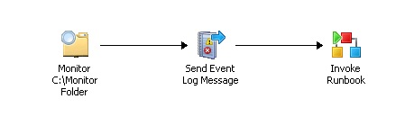

# Monitor a Folder within a Runbook
This sample shows you how to create a simple monitor runbook that monitors a folder for new text files. When a file is detected, the runbook sends an event log message, and then starts another runbook.  
  
  
  
## Create and test a monitor runbook  
The procedures to create, configure, and test a sample runbook that monitors a folder are described below.  
  
#### To create the workflow  
  
1.  In the Runbook Designer **Connections** pane, right\-click the **Runbooks** folder to select **New**, and then click **Runbook**.  
  
2.  Right\-click the **New Runbook** tab to select **Rename**.  
  
3.  In the **Confirm Check out** dialog box, click **Yes**.  
  
4.  Type a name for the runbook, such as **Monitor Runbook**, and then press Enter.  
  
5.  In the **Activities** pane, click **File Management** to expand the category, and then drag the **Monitor Folder** activity into the **Runbook Designer** Design workspace.  
  
6.  In the **Activities** pane, click **Notification** to expand the category, and then drag the **Send Event Log Message** activity into the **Runbook Designer** Design workspace, to the right of the **Monitor Folder** activity.  
  
7.  In the **Runbook Designer** Design workspace, move your pointer over the right side of the **Monitor Folder** activity to display the smart link arrow.  
  
8.  Click the smart link arrow, and then drag it to the **Send Event Log Message** activity.  
  
9. In the **Activities** pane, click **Runbook Control** to expand the category, and then drag the **Invoke Runbook** activity into the **Runbook Designer** Design workspace, to the right of the **Send Event Log Message** activity.  
  
10. In the **Runbook Designer** Design workspace, move your pointer over the right side of the **Send Event Log Message** activity to display the smart link arrow.  
  
11. Click the smart link arrow, and then drag it to the **Invoke Runbook** activity.  
  
#### To configure the workflow  
  
1.  In the **Runbook Designer** Design workspace, double\-click the **Monitor Folder** activity.  
  
2.  In the **Monitor Folder Properties** dialog box, click the **General** tab.  
  
3.  In the **Name** box, change the name of the activity to something informative, for example **Monitor C:\\Monitor Folder**.  
  
4.  Click the **Details** tab.  
  
5.  On the **Details** tab, in the **Path** box, type the path of the folder you want to monitor, for example **C:\\Monitor**.  
  
6.  Below the **File Filters** list, click **Add**.  
  
7.  In the **Filter Settings** dialog box, set the following:  
  
    1.  In the **Name** list box, select **File Name**.  
  
    2.  In the **Relation** list box, select **Matches pattern**.  
  
    3.  In the **Value** box, type **\*.txt**.  
  
        This setting directs the monitor to look for files with the **txt** extension. This field accepts regular expression syntax.  
  
8.  Click **OK**.  
  
9. Select the **Triggers** tab.  
  
10. Select the **Number of files is** option, set the value in the list to **greater than**, and then type **0** in the edit box.  
  
11. Click **Finish**.  
  
12. In the **Runbook Designer** Design workspace, double\-click the **Send Event Log Message**.  
  
13. In the **Send Event Log Message Properties** dialog box, on the **Details** tab, in the **Properties** section, set the following:  
  
14. 1.  In the **Computer** box, type the name of the computer to receive the Event message.  
  
        This is typically the computer where you are running Runbook Designer.  
  
    2.  In the **Message** box, type the message to display in the Event log, for example, **File Detected**.  
  
    3.  Leave the **Severity** level at **Information**.  
15. Click **Finish**.  
  
    > [!NOTE]  
    > In this sample, the **Invoke Runbook** activity is not configured. For more information about configuring this activity, see the [Invoke Runbook](../../orch/reference/Invoke-Runbook.md) activity in the [!INCLUDE[orchlong](../../orch/deploy//orchlong_md.md)] Runbook Activity Reference.  
  
#### To modify runbook settings  
  
1.  Above the **Runbook Designer** Design workspace, right\-click the **Monitor Runbook** tab to select **Properties**.  
  
2.  In the **Monitor Runbook Properties** dialog, click the **Logging** tab, and then select both **Store Activity\-specific Returned Data** and **Store Common Returned Data**.  
  
3.  Click **Finish**.  
  
4.  Right\-click the **Monitor Runbook** tab to select **Check In**.  
  
## Test the runbook  
In the Runbook Tester, you can test runbooks in a simulated runtime and debugging environment. You can run an entire runbook, step through it one activity at a time, or add breakpoints to stop the simulation at any activity that you select.  
  
Use the following steps to test your runbook in the **Runbook Tester**.  
  
#### To prepare your computer  
  
1.  Right\-click **Start** to select **Open Windows Explorer**.  
  
2.  Create a **C:\\Monitor** folder on your computer.  
  
3.  Create a **C:\\Source** folder on your computer.  
  
4.  In the **C:\\Source** folder, create a file with a **txt** extension, for example **text.txt**.  
  
#### To test the runbook  
  
1.  In the **Runbook Designer** Design workspace, select the **Monitor Runbook** tab.  
  
2.  On the toolbar above the **Runbook Designer** Design workspace, click **Runbook Tester**.  
  
3.  In the **Confirm Check out** dialog box, click **Yes**.  
  
4.  In **Runbook Tester**, on the toolbar, click **Step Over** to start stepping through the runbook.  
  
    > [!TIP]  
    > To increase the size of the **Log** pane, remove the **Resource Browser** pane by selecting **View** on the menu, and then clearing the **Resource Browser** option.  
  
5.  In Windows Explorer, browse to the **C:\\Source** folder.  
  
6.  Copy **test.txt** to **C:\\Monitor**.  
  
7.  Close Windows Explorer.  
  
8.  On the Runbook Tester toolbar, click **Next**.  
  
    After a few moments, note that the **Log** pane entry updates and shows an event for the **Monitor Folder** activity.  
  
9. On the **Log** pane Click the **Show Details** link to see the contents of the data bus for that runbook.  
  
10. Scroll down the list of properties. Note that the activity status is **success** indicating that the **Monitor Folder** activity detected the change in the folder.  
  
11. On the Runbook Tester toolbar, click **Next**.  
  
    Notice that the **Log** pane changes and shows an event for the **Send Event Log Message** activity.  
  
12. Click the **Show Details** link and note that the activity status is **success** indicating that the **Send Event Log Message** activity detected the change in the folder.  
  
13. Close **Runbook Tester**.  
  
14. On the **Runbook Designer** toolbar, click **Check In**.  
  
## See Also  
[Runbook Samples](../../orch/manage/Runbook-Samples.md)  
  
