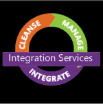
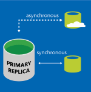
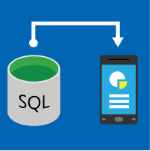

# SQL Server 2016 Technical Documentation
  Documentation to help you install, configure, and use SQL Server 2016 features and scenarios. The content includes end-to-end examples, code samples, and videos. For the latest release notes, see [SQL Server 2016 Release Notes](../../Topics/TopicNameNotContainA/SQL-Server-2016-Release-Notes.md). For the latest information on what is new, see [What's New in SQL Server 2016](../../Topics/TopicNameNotContainA/What-s-New-in-SQL-Server-2016.md).
    
 **Try it out:**    
    
-     Download SQL Server 2016  from the **[Evaluation Center](https://www.microsoft.com/en-us/evalcenter/evaluate-sql-server-2016)**    
    
-   Have an Azure account?  Then go **[Here](https://azure.microsoft.com/en-us/marketplace/partners/microsoft/sqlserver2016rtmenterprisewindowsserver2012r2/?wt.mc_id=sqL16_vm)** to spin up a Virtual Machine with [!INCLUDE[ssCurrent](../../Topics/TopicNameContainA/includes/ssCurrent_md.md)] already installed.    
    
  -    To get the latest version of SQL Server Management Studio, see **[Download SQL Server Management Studio (SSMS)](https://msdn.microsoft.com/library/mt238290.aspx)**.   
    
  
    
## SQL Server Technologies    
    
||Technology|    
|-|-|    
||**[Database Engine](../../Topics/TopicNameNotContainA/SQL-Server-Database-Engine.md)**   The Database Engine is the core service for storing, processing, and securing data. The Database Engine provides controlled access and rapid transaction processing to meet the requirements of the most demanding data consuming applications within your enterprise. The Database Engine also provides rich support for sustaining high availability.|    
||**[R Services](../../Topics/TopicNameNotContainA/R-Services.md)**   Microsoft R Services provides multiple ways to incorporate the popular R language into enterprise workflows.   [!INCLUDE[rsql_productname](../../Topics/TopicNameContainA/includes/rsql_productname_md.md)] integrates the R language with [!INCLUDE[ssNoVersion](../../Topics/TopicNameContainA/includes/ssNoVersion_md.md)], making it easy to build, retrain, and score models by calling [!INCLUDE[tsql](../../Topics/TopicNameContainA/includes/tsql_md.md)] stored procedures.   Microsoft R Server provides multi-platform, scalable support for R in the enterprise, and supports data sources such as Hadoop and Teradata.|    
||**[Data Quality Services](../../Topics/TopicNameNotContainA/Data-Quality-Services.md)**   SQL Server Data Quality Services (DQS) provides you with a knowledge-driven data cleansing solution. DQS enables you to build a knowledge base, and then use that knowledge base to perform data correction and deduplication on your data, using both computer-assisted and interactive means. You can use cloud-based reference data services, and you can build a data management solution that integrates DQS with SQL Server Integration Services and Master Data Services.|    
||**[Integration Services](../../Topics/TopicNameNotContainA/SQL-Server-Integration-Services.md)**   [!INCLUDE[ssISnoversion](../../Topics/TopicNameContainA/includes/ssISnoversion_md.md)] is a platform for building high performance data integration solutions, including packages that provide extract, transform, and load (ETL) processing for data warehousing.|    
||**[Master Data Services](../../Topics/TopicNameNotContainA/Master-Data-Services.md)**   [!INCLUDE[ssMDSshort](../../Topics/TopicNameContainA/includes/ssMDSshort_md.md)] is the [!INCLUDE[ssNoVersion](../../Topics/TopicNameContainA/includes/ssNoVersion_md.md)] solution for master data management. A solution built on [!INCLUDE[ssMDSshort](../../Topics/TopicNameContainA/includes/ssMDSshort_md.md)] helps ensure that reporting and analysis is based on the right information. Using [!INCLUDE[ssMDSshort](../../Topics/TopicNameContainA/includes/ssMDSshort_md.md)], you create a central repository for your master data and maintain an auditable, securable record of that data as it changes over time.|    
||**[Analysis Services](../../Topics/TopicNameNotContainA/Analysis-Services.md)**   [!INCLUDE[ssASnoversion_md](../../Topics/TopicNameContainA/includes/ssASnoversion_md.md)] is an analytical data platform and toolset for personal, team, and corporate business intelligence. Servers and client designers support traditional OLAP solutions, new tabular modeling solutions, as well as self-service analytics and collaboration using [!INCLUDE[ssGemini](../../Topics/TopicNameContainA/includes/ssGemini_md.md)], Excel, and a SharePoint Server environment. [!INCLUDE[ssASnoversion](../../Topics/TopicNameContainA/includes/ssASnoversion_md.md)] also includes Data Mining so that you can uncover the patterns and relationships hidden inside large volumes of data.|    
||**[Replication](../../Topics/TopicNameNotContainA/SQL-Server-Replication.md)**   Replication is a set of technologies for copying and distributing data and database objects from one database to another, and then synchronizing between databases to maintain consistency. By using replication, you can distribute data to different locations and to remote or mobile users by means of local and wide area networks, dial-up connections, wireless connections, and the Internet.|    
||**[Reporting Services](../../Topics/TopicNameNotContainA/Reporting-Services--SSRS-.md)**   Reporting Services delivers enterprise, Web-enabled reporting functionality so you can create reports that draw content from a variety of data sources, publish reports in various formats, and centrally manage security and subscriptions.|    
     
    
 **SQL Server Web Sites**    
    
-   [Find videos, samples, and community resources](../../Topics/TopicNameNotContainA/SQL-Server-2016-Resources.md) for [!INCLUDE[ssCurrent](../../Topics/TopicNameContainA/includes/ssCurrent_md.md)].   
    
-   [Introducing SQL Server 2016](https://www.microsoft.com/en-us/server-cloud/products/sql-server/default.aspx?WT.srch=1&WT.mc_id=SEM_%5B_uniqid%5D&utm_source=Bing&utm_medium=CPC&utm_term=SQL%20Server%202016&utm_campaign=Data_Management).  
    
## See Also    
+ [SQL Server Configuration Manager](../../Topics/TopicNameNotContainA/SQL-Server-Configuration-Manager.md)
 
+ [Install SQL Server Database Engine](../../Topics/TopicNameNotContainA/Install-SQL-Server-Database-Engine.md) 
+ [Install SQL Server Management Tools with SSMS](https://msdn.microsoft.com/library/bb500441.aspx) 
 + [SQL Server Data Tools in Visual Studio 2015](https://msdn.microsoft.com/mt186501.aspx)
  