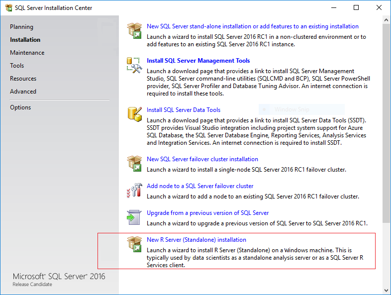

# Create a Standalone R Server
  [!INCLUDE[ssNoVersion](../../Topics/TopicNameContainA/includes/ssNoVersion_md.md)] setup now includes the option to install **Microsoft R Server (Standalone)**. This option lets you develop high performance R solutions on Windows while connecting to the database or data source of your choice.   
  
 When you install Microsoft R Server, you get the same enhanced R packages and connectivity tools that are provided in [!INCLUDE[rsql_productname](../../Topics/TopicNameContainA/includes/rsql_productname_md.md)], but an instance of [!INCLUDE[ssNoVersion](../../Topics/TopicNameContainA/includes/ssNoVersion_md.md)] is not required and the execution of R scripts is performed on the standalone computer, not in database.  
  
> [!NOTE]  
>  Microsoft R Server is available only in Enterprise Edition.  
>  
  
##   Install Microsoft R Server (Standalone)  
  
1.  If you have installed a previous version of Microsoft R Server, you must uninstall it first.  See [Upgrading from an Older Version of Microsoft R Server](#bkmk_Uninstall). 

2. Run [!INCLUDE[ssNoVersion](../../Topics/TopicNameContainA/includes/ssNoVersion_md.md)] setup.  
  
2.  On the **Installation** tab, click **New R Server (Standalone) installation** .  
  
       
  
3.  On the **Feature Selection** page, the following option should be already selected:  
  
    -   **R Server (Standalone)**  
  
         This  option installs shared features, including open source R tools and base packages, and the enhanced R packages and connectivity tools provided by Microsoft R.  
  
     All other options can be ignored.  
  
4.  Accept the license terms for downloading and installing Microsoft R Open. When the **Accept** button becomes unavailable, you can click **Next**. Installation of these components (and any prerequisites they might require) might take a while.   
  
5.  On the **Ready to Install** page, verify your selections, and click **Install**.  
  
### Installing Microsoft R Server from the Command LIne

From SQL Server setup media, you can install Microsoft R Server (Standalone) by using this set of arguments:

`Setup.exe /q /ACTION=Install /FEATURES=SQL_SHARED_MR  /IACCEPTSQLSERVERLICENSETERMS /IACCEPTROPENLICENSETERMS `

  
## What is Installed and Where to Find R Packages  
 Microsoft R Server includes the R base packages and a set of enhanced R packages that support parallel processing, improved performance, and connectivity to data sources including [!INCLUDE[ssNoVersion](../../Topics/TopicNameContainA/includes/ssNoVersion_md.md)] and Hadoop.  
  
-   **R  packages**  
  
     The R libraries are installed together with other tools and utilities that are installed with Microsoft SQL Server 2016. For example:  
  
     `C:\Program Files\Microsoft SQL Server\130\R_SERVER`  
  
     Additionally, in this folder you will find documentation for the R base packages, sample data, and documentation of the R tools and runtime.  
  
    > [!NOTE]  
    >  If you have installed an instance of SQL Server with R Services (In-Database) on the same computer, the R libraries and tools are installed into a different folder:  `C:\Program Files\Microsoft SQL Server\<instance_name>\R_SERVICES`  
    >   
    >  Do not use the R packages or utilities associated with the [!INCLUDE[ssNoVersion_md](../../Topics/TopicNameContainA/includes/ssNoVersion_md.md)] instance. Always use the R tools and packages in the R_SERVER folder.  
  
-   **R  tools**  
  
     An R development IDE is not installed as part of setup. You can install RStudio, [!INCLUDE[rsql_rtvs](../../Topics/TopicNameContainA/includes/rsql_rtvs_md.md)],  or any other development environment you prefer.  
  
     However, additional tools aren't required. All the standard base R tools are included in `C:\Program Files\Microsoft SQL Server\130\R_SERVER\bin`.  
  
     For more information, see [Setup or Configure R Tools](../../Topics/TopicNameNotContainA/Setup-or-Configure-R-Tools.md).  

 
## Troubleshooting  

### Cannot add Microsoft R Server to an instance of SQL Server installed on Windows Core
There is a known issue when adding Microsoft R Server to an instance on Windows Server Core edition. For more information, see [Can't install Microsoft R Server Standalone on a Windows Server Core operating system](https://support.microsoft.com/kb/3168691).

After you have applied the fix described in [KB3164398](https://support.microsoft.com/kb/3164398), you can add the R feature to the existing instance on Windows Server Core.   

###   Upgrading from an Older Version of Microsoft R Server  
 If you installed a pre-release version of Microsoft R Server, you must uninstall it before you can upgrade to a newer version.  
  
**To uninstall R Server (Standalone)**  
  
1.  In **Control Panel**, click **Add/Remove Programs**, and select `Microsoft SQL Server 2016 <version number>`.  
  
2.  In the dialog box with options to **Add**, **Repair**, or **Remove** components, select **Remove**.  
  
3.  On the **Select Features** page, under **Shared Features**, select **R Server (Standalone)**. Click **Next**, and then click **Finish** to uninstall just the selected components.  
   
### Installation fails with error "Only one Revolution Enterprise product can be installed at a time."  
You must uninstall any previous versions before you can install a newer version of Microsoft R Server. Side-by-side installation with other versions of the REvolution Enterprise tools is also not supported.  
  
### Unable to uninstall older components  
  
If you have problems removing an older version, you might need to edit the registry to remove related keys.  
  
1. Open the Windows Registry, and locate this key: `HKLM\Software\Microsoft\Windows\CurrentVersion\Uninstall`.  
2. Delete any of the following entries if present, and if the key contains only the value `sEstimatedSize2`:  
  
    -   E0B2C29E-B8FC-490B-A043-2CAE75634972        (for 8.0.2)  
  
    -   46695879-954E-4072-9D32-1CC84D4158F4        (for 8.0.1)  
  
    -   2DF16DF8-A2DB-4EC6-808B-CB5A302DA91B        (for 8.0.0)  
  
    -   5A2A1571-B8CD-4AAF-9303-8DF463DABE5A        (for 7.5.0)  
  
## See Also  
 [Microsoft R Server](../../Topics/TopicNameNotContainA/R-Server--Standalone-.md)  
  
  