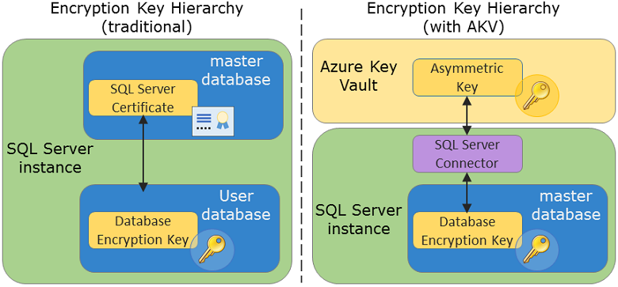

# Extensible Key Management Using Azure Key Vault (SQL Server)
  The [!INCLUDE[ssNoVersion](../../Topics/TopicNameContainA/includes/ssNoVersion_md.md)] Connector for [!INCLUDE[msCoName](../../Topics/TopicNameContainA/includes/msCoName_md.md)] Azure Key Vault enables [!INCLUDE[ssNoVersion](../../Topics/TopicNameContainA/includes/ssNoVersion_md.md)] encryption to use the Azure Key Vault service as an [Extensible Key Management &#40;EKM&#41;](../../Topics/TopicNameNotContainA/Extensible-Key-Management--EKM-.md) provider to protect [!INCLUDE[ssNoVersion](../../Topics/TopicNameContainA/includes/ssNoVersion_md.md)] encryption keys.  
  
 This topic describes the [!INCLUDE[ssNoVersion](../../Topics/TopicNameContainA/includes/ssNoVersion_md.md)] connector. Additional information is available in [Setup Steps for Extensible Key Management Using the Azure Key Vault](../../Topics/TopicNameNotContainA/Setup-Steps-for-Extensible-Key-Management-Using-the-Azure-Key-Vault.md), [Use SQL Server Connector with SQL Encryption Features](../../Topics/TopicNameNotContainA/Use-SQL-Server-Connector-with-SQL-Encryption-Features.md), and [SQL Server Connector Maintenance & Troubleshooting](SQL%20Server%20Connector%20Maintenance%20&%20Troubleshooting.md).  
  
##   What is Extensible Key Management (EKM) & Why Use it?  
 [!INCLUDE[ssNoVersion](../../Topics/TopicNameContainA/includes/ssNoVersion_md.md)] provides several types of encryption that help protect sensitive data, including [Transparent Data Encryption &#40;TDE&#41;](../../Topics/TopicNameNotContainA/Transparent-Data-Encryption--TDE-.md), [Column Level Encryption](../Topic/Cryptographic%20Functions%20\(Transact-SQL\).md) (CLE), and [Backup Encryption](../../Topics/TopicNameNotContainA/Backup-Encryption.md). In all of these cases, in this traditional key hierarchy, the data is encrypted using a symmetric data encryption key (DEK). The symmetric data encryption key is further protected by encrypting it with a hierarchy of keys stored in [!INCLUDE[ssNoVersion](../../Topics/TopicNameContainA/includes/ssNoVersion_md.md)]. Instead of this model, the alternative is the EKM Provider Model. Using the EKM provider architecture enables [!INCLUDE[ssNoVersion](../../Topics/TopicNameContainA/includes/ssNoVersion_md.md)] to protect the data encryption keys by using an asymmetric key stored outside of [!INCLUDE[ssNoVersion](../../Topics/TopicNameContainA/includes/ssNoVersion_md.md)] in an external cryptographic provider. This model adds an additional layer of security and separates the management of keys and data.  
   
 The following image compares the traditional service-manage key hierarchy with the Azure Key Vault system.  
  
   
  
   
 The [!INCLUDE[ssNoVersion](../../Topics/TopicNameContainA/includes/ssNoVersion_md.md)] Connector serves as a bridge between [!INCLUDE[ssNoVersion](../../Topics/TopicNameContainA/includes/ssNoVersion_md.md)] and Azure Key Vault, so [!INCLUDE[ssNoVersion](../../Topics/TopicNameContainA/includes/ssNoVersion_md.md)] can leverage the scalability, high performance, and highly availability of the Azure Key Vault service. The following image represents how the key hierarchy works in the EKM provider architecture with Azure Key Vault and [!INCLUDE[ssNoVersion](../../Topics/TopicNameContainA/includes/ssNoVersion_md.md)] Connector.  
  
  Azure Key Vault can be used with [!INCLUDE[ssNoVersion](../../Topics/TopicNameContainA/includes/ssNoVersion_md.md)] installations on [!INCLUDE[msCoName](../../Topics/TopicNameContainA/includes/msCoName_md.md)] Azure Virtual Machines and for on-premises servers. The key vault service also provides the option to use tightly controlled and monitored Hardware Security Modules (HSMs) for a higher level of protection for asymmetric encryption keys. For more information about the key vault, see [Azure Key Vault](http://go.microsoft.com/fwlink/?LinkId=521401).  
  
 The following image summarizes the process flow of EKM using the key vault. (The process step numbers in the image are not meant to match the setup step numbers that follow the image.)  
  
   

> [!NOTE]  
>  Versions 1.0.0.440 and older have been replaced and are no longer supported in production environments. Upgrade to version 1.0.1.0 or later by visiting the [Microsoft Download Center](https://www.microsoft.com/download/details.aspx?id=45344) and using the instructions on the [SQL Server Connector Maintenance & Troubleshooting](SQL%20Server%20Connector%20Maintenance%20&%20Troubleshooting.md) page under “Upgrade of SQL Server Connector.”
  
 For the next step, see [Setup Steps for Extensible Key Management Using the Azure Key Vault](../../Topics/TopicNameNotContainA/Setup-Steps-for-Extensible-Key-Management-Using-the-Azure-Key-Vault.md).  
  
 For use scenarios, see [Use SQL Server Connector with SQL Encryption Features](../../Topics/TopicNameNotContainA/Use-SQL-Server-Connector-with-SQL-Encryption-Features.md).  
  
## See Also  
 [SQL Server Connector Maintenance & Troubleshooting](SQL%20Server%20Connector%20Maintenance%20&%20Troubleshooting.md)  
  
  